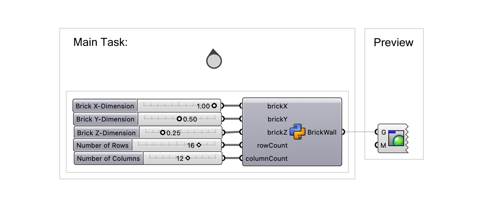
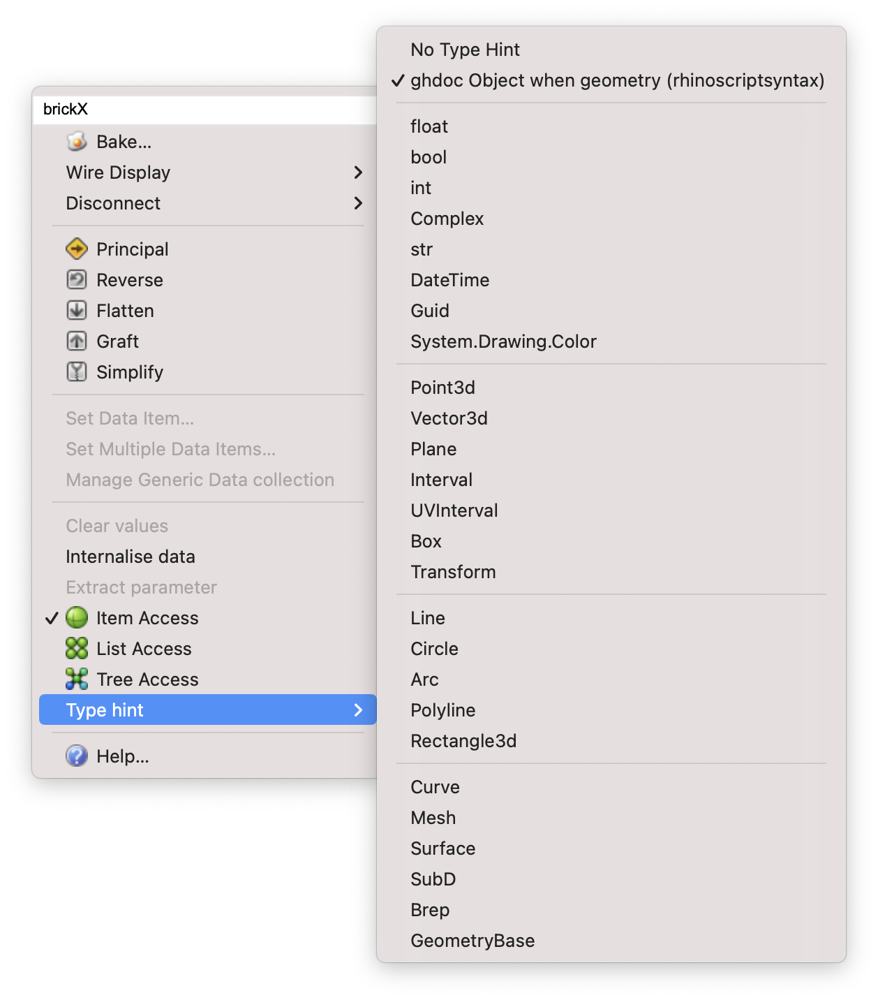
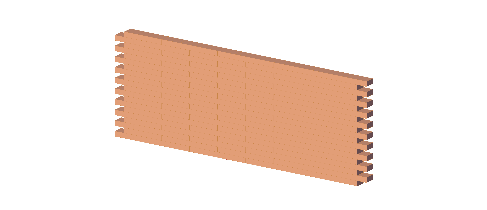
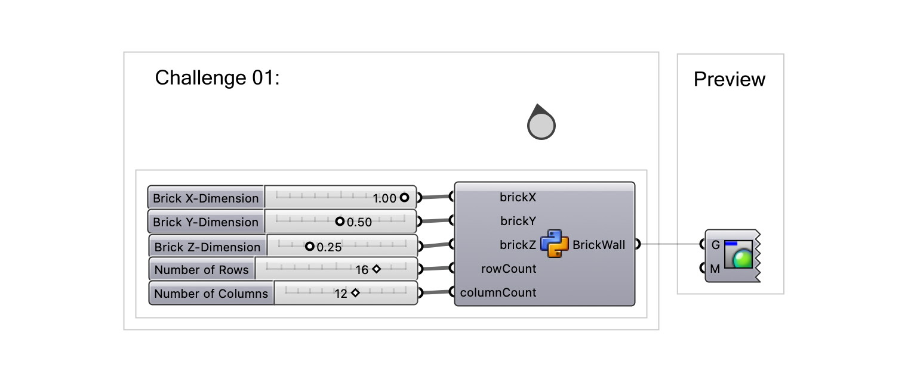
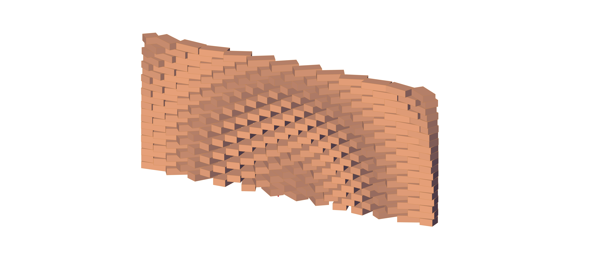
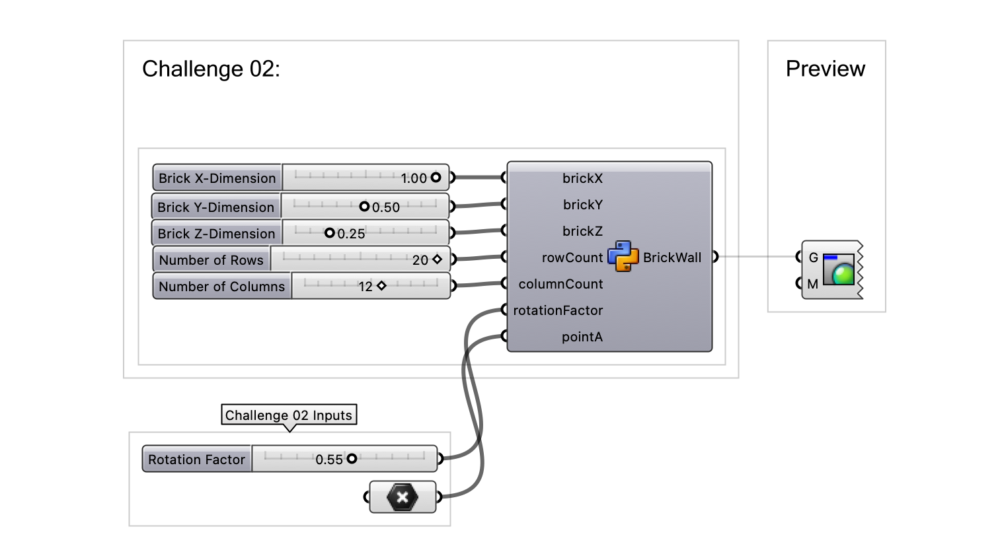
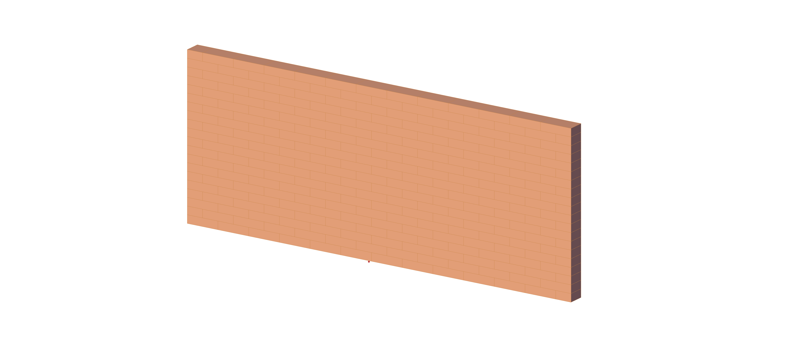

# Assignment 01

> Goal: Apply basic Python programming concepts to create a brick-wall (Functions, control structures, lists, geometry)

### Main Task

- Create a virtual brick wall using Python and the COMPAS framework. 
- Your brick dimensions as well as wall height and length should react parametrically to 
the provided input sliders.
- Implement the wall such that every other row is offset by half the brick's length to mimic 
a strecher bond pattern.

### Details

- Create a Python script that generates a 3D representation of a brick wall.
- Each brick should be represented as an instance of the `Box` class from the COMPAS geometry 
module.
- Create a fully parametric brick wall by making use of the provided number sliders:
  - Use the input sliders for the brick dimensions (`xsize`, `ysize` and `zsize`).
  - Use the input sliders for the number of rows and columns(`row_count` and `column_count`) to 
  control the number of bricks in both directions.
- Ensure that the data type of the input sliders matches those specified on the prepared 
number sliders. (Right-click each of the inputs and navigate to **Type hint**.)

### Bonus Tasks

- Introduce a mortar gap (Moertelfuge) between the bricks of a fixed size across all bricks. 
  Ensure that the gap size is consistent across all bricks.

### Functions, Classes, Methods, and Statements You Will Need

- Geometric types (`Box`, `Point` from COMPAS).
- Loop statements (for loops for generating rows and columns).
- Conditional statements (for applying row offset).

## Challenge 01

Rotate the bricks following any logic you want, for example, according
to their distance from a reference point (attractor point) in 3D space.
The rotation will create a visual pattern that is very recognizable as computational design aesthetics.
This is an essential exercise in computational design, as you will learn how to bring
different things into a numerical relationship.

### Details

- Starting point is your script of the main task, most things remain the same but after
  moving the brick to its position, you will add a rotation.
- Rotations are done using the method `.rotate()` inside the frame of an object.
  For example, to rotate a box around the point (0, 0, 0), you can do:
      box.frame.rotate(3.14 / 2, point=(0, 0, 0))
  Notice that the angle of rotation is in RADIANS, not degrees.
  You can find more details in the the API reference of COMPAS framework for the class `Frame`.
- The amount of rotation can be determined by any logic of your choice: fixed, random, based 
  on arithmetic, based on geometry (e.g. euclidean distance), based on maths (e.g. apply
  the math.sin function to a value), etc.

### Bonus

- If you use an attractor point as reference, you can choose to use a referenced point
  from Grasshopper instead of hard-coding the attractor point.

## Challenge 02

Improve the previous script (either with or without challenge 01) by introducing
half-bricks at the start and end of every other row. This will create a more
realistic and structurally sound brick pattern, similar to how bricks are laid
in typical stretcher bond.

### Details

- Modify your script to include half-bricks at the start or end of every other row.
- Find a way to differentiate between every other row of bricks to facilitate your placement logic of the half-bricks.
- Ensure the half-bricks are correctly proportioned, such that the wall ends are flush.
- Ensure the half-bricks are correctly positioned and aligned with the full bricks, taking into account the staggered pattern.

## Deliverables

One zip file [`mustermann_max_A-01.zip`] containing:

- Grasshopper File (`.ghx`):
  - File Name: `mustermann_max_A-01.ghx`
- Screenshots (`.png`):
  - File Name: `mustermann_max_A-01_xx.png`
  - Dimensions: 3200x2400 px
  - View: Parallel, Shaded

## Submission

Upload the assignment via Moodle.