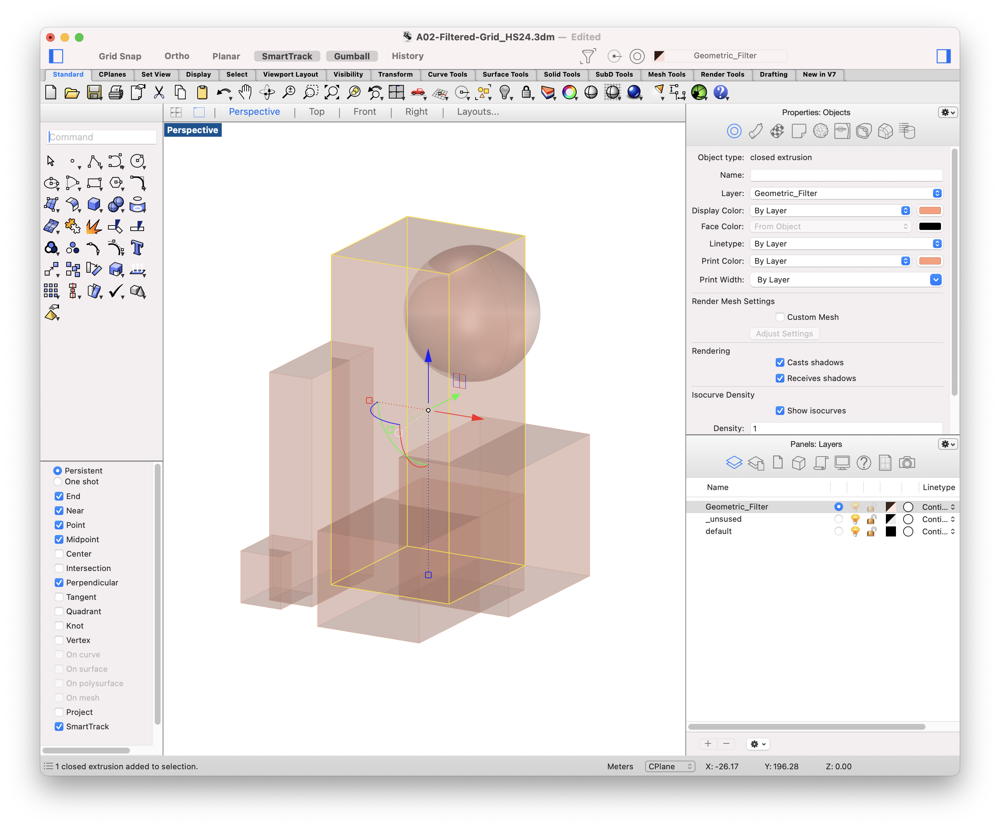
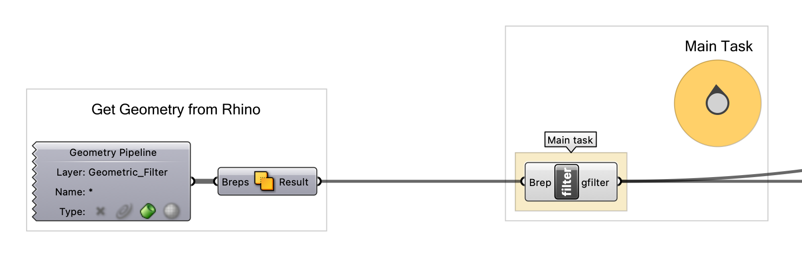
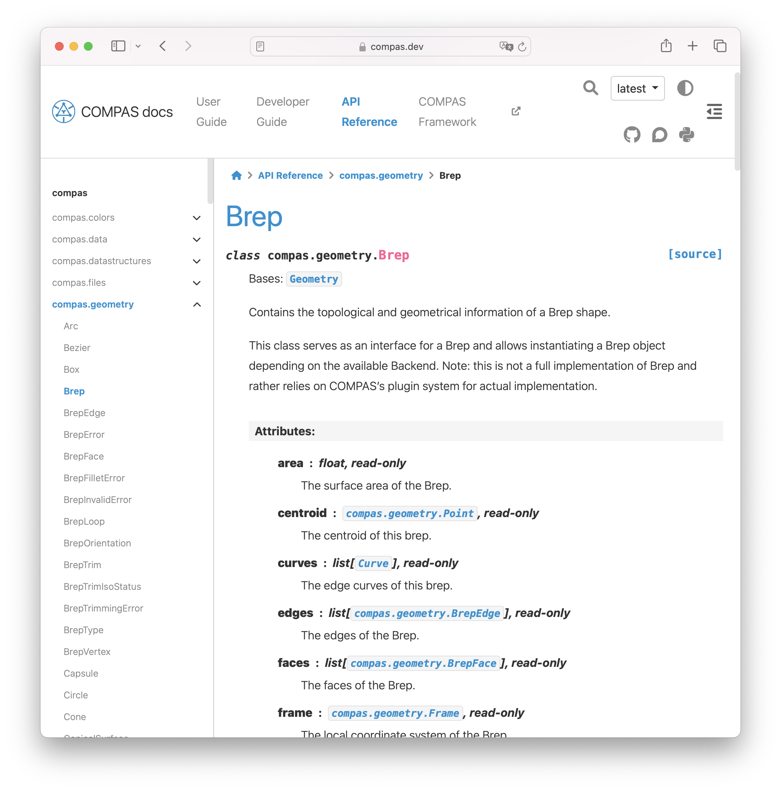
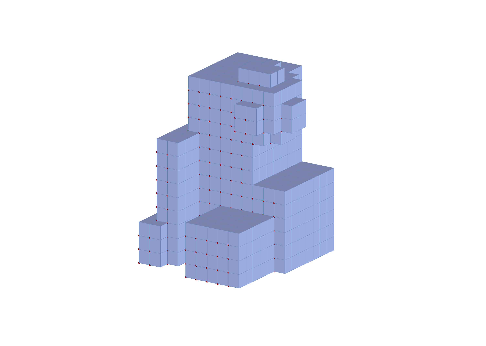
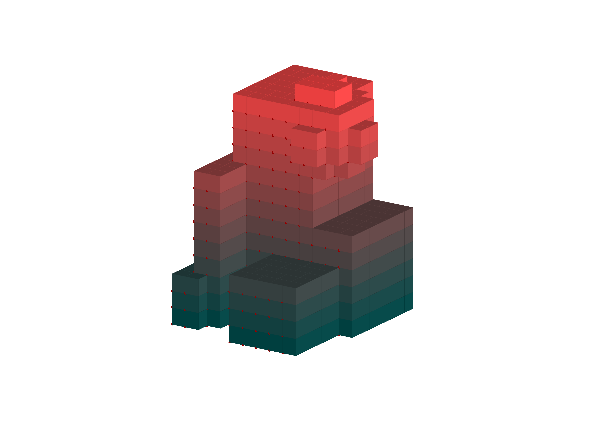
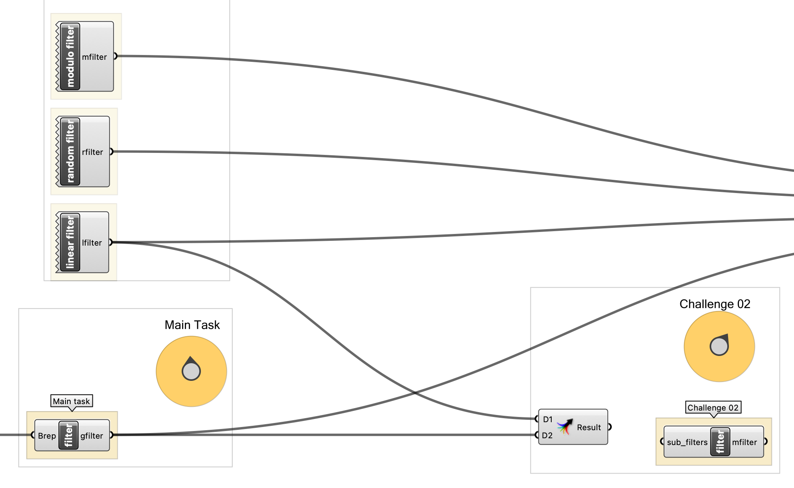
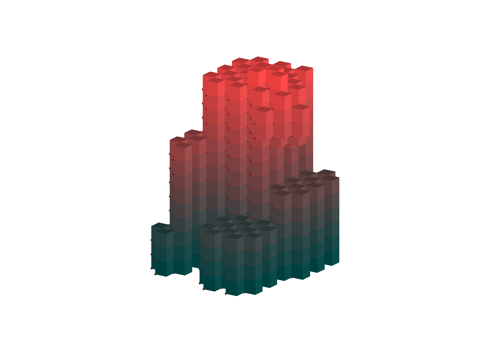

# Assignment 02

> Goal: apply object-oriented programming to the filtered 3D grid.

### Main task

Create a new kind of filter by implementing a new class. Use the examples above
as inspiration on how to convert the filters we have seen in previous weeks to classes!

This new filter will allow intuitive control over the design by leveraging a
geometric input. Specifically, the filter should use a Brep (referenced from Rhino)
to determine whether a point should be included in the final result.

We have prepared a geometry pipeline for you on the Grasshopper canvas, that 
automatically reads all Breps on the `Geometric_Filter` Rhino layer and combines 
it to a single Brep.

Your filter class should have one method `is_included` that takes 4 parameters 
as input: point and ix, iy, iz and returns `True` or `False` as output, indicating whether the 
specific point lies inside or outside the referenced Brep.
NOTE: it's important to understand the difference between the parameters `ix`, `iy`, `iz`
which are the indices relative to the grid's start (0,0,0), and the point, which will contain x, y and z
coordinates in 3d space and will be world-relative instead.
After completion you should be able to shape or sculpt your grid to your taste.

You can configure the filter to either keep the points where True is returned,
enabling an additive sculpting workflow, or remove those points, creating a
subtractive sculpting workflow. This gives you control over whether you're
"building up" geometry by including points or "carving out" geometry by
excluding them.

#### Details

- Create a class, for example, BrepFilter.
- Add a method `is_included` to it. This method should return `True` if the 
point is inside the Brep geometry, otherwise `False. (Or you can reverse this logic to taste)
- Right below the class, create an instance of it and assign it to the output 
of this component.
- Plug the component into the Stream filter to test its functionality.

#### Bonus (Not relevant for grading)

- Add a `__str__` magic method that returns a string describing the filter in a nice way.
- Create two filters, one for an additive sculpting workflow, and one for a subtractive one.

#### Functions, classes, methods and statements that you will need

- Class definition
- A class constructor (`__init__`).
- Attributes of a class. For the Brep filter, you will need to convert the Rhino Brep to a COMPAS Brep using `Brep.from_native()`.

#### Hints
- You will use the `Brep.from_native()` method to convert the Rhino Brep to a COMPAS Brep. The `Brep`  class of COMPAS needs to be imported from `compas.geometry`.
- You need to find a method that checks whether or not a point is contained within a brep
    - https://compas.dev/compas/latest/api/index.html
    - navigate to geometry > brep and look at the provided methods.

Create your desired grid shape in Rhino by adding or removing geometry. 

This is your starting point. Here the geometry is loaded automatically from the rhino layer "Geometric_Filter". Other layers are unaffected.

Here you see the COMPAS API reference, where you can find the methods required to create the filter.

This could be your final result for the main task.

---

## Challenge 01

In this challenge, you will extend the current box visualization setup by introducing an additional data value for each point in the grid based on its Z-coordinate. This value will be remapped to a range from 0 to 255, and output along with the boxes. Then this data will be connected to a color component to control the material color based on the height of each point.

Your goal is to calculate this additional data value for every box included in the final grid, then output it alongside the existing boxes.

#### Details

- For each filtered point in the grid, calculate a value based on its Z-coordinate.
- Remap the Z-coordinate of each point to a value between 0 and 255.
- Create a new output variable (in the Grasshopper component) to store these remapped values.
- Ensure both the boxes and the corresponding Z-values are outputted for further use (i.e., for coloring the boxes in Grasshopper).

#### Functions, methods and statements that you will need

- A remapping function to transform Z-coordinates into the range [0, 255].
- `.append` to store the remapped Z-values.
- The `min()` and `max()` functions to help with remapping.

---

## Challenge 02

In this challenge, you will create a filter that combines two existing filters and allows you to control how they are combined using either Union (OR) or Intersection (AND) logic. The `is_included` method should return `True` based on the logic chosen:

- Union: This logic returns True if either of the filters returns True. It works like "Include the point if it satisfies either filter."
- Intersection: This logic returns True only if both filters return True. It works like "Include the point only if it satisfies both filters."

#### Details

- Create a new class `MergeFilter` that combines two filters using either of the two proposed logics.
- The constructor (`__init__`) should take two filters as parameters (`f1` and `f2`).
- Implement an `is_included` method that checks the points based on either the Union (OR) or Intersection (AND) logic.

#### Bonus Tasks (Not relevant for Grading)

- Allow for a Switch between the two methods, by introducing a Boolean Toggle
- Change the initial Geometric-Filter from the Main Task to work for multiple input geometries. Rather than using the Solid Union Grasshopper component, implement functionality, such that the filter class handles multiple geometries by itself.

#### Functions, methods, and statements that you will need

- Class definition.
- `if` statement.
- Logical operators (`and`, `or`).
- Use an attribute of the class to store the two filters.

In this case we have combined the main task filter with the modulo filter in intersection mode.

## Deliverables

One zip file [`mustermann_max_A-02.zip`] containing:

- Grasshopper File (`.ghx`):
  - File Name: `mustermann_max_A-02.ghx`
- Screenshots (`.png`):
  - File Name: `mustermann_max_A-02_xx.png`
  - Dimensions: 3200x2400 px
  - View: Parallel, Shaded

## Submission

Upload the assignment via Moodle.