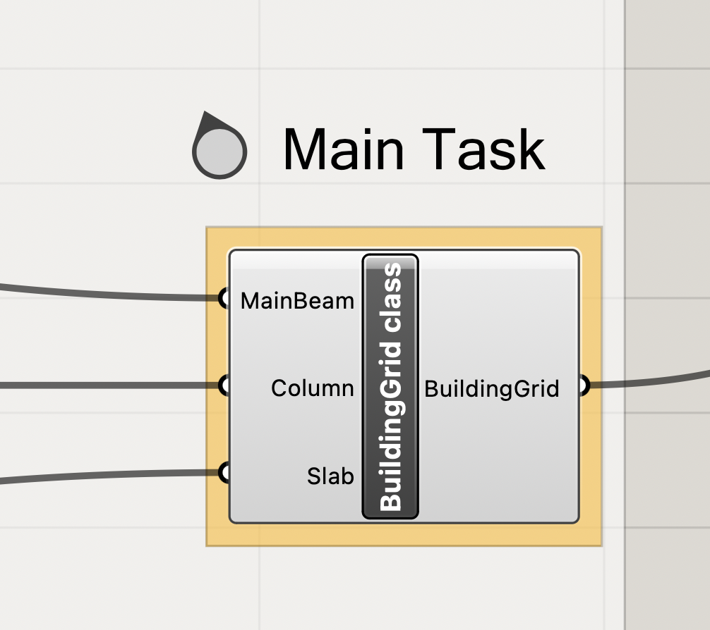
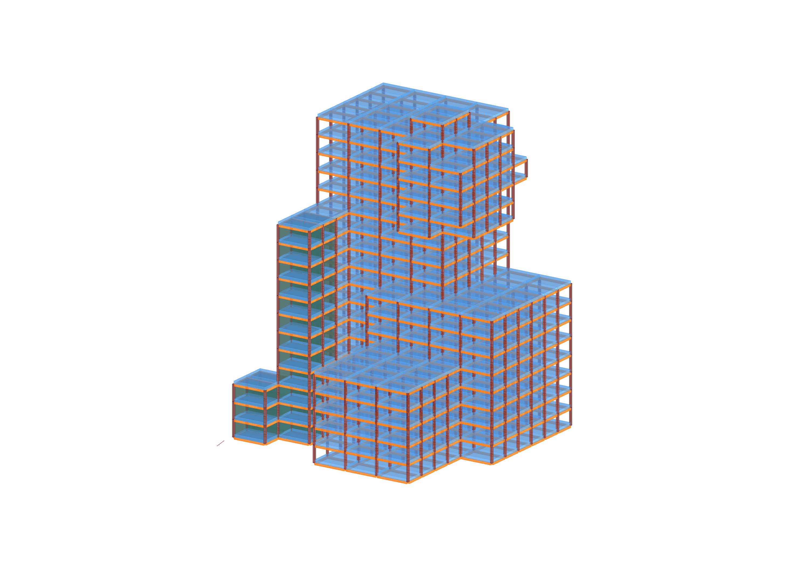
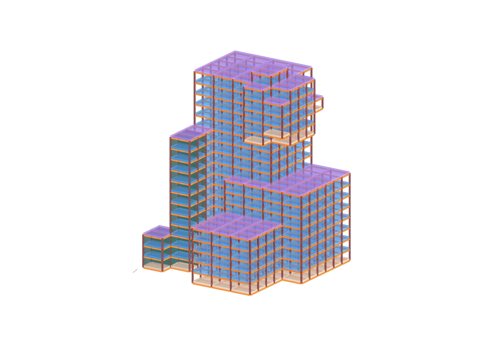
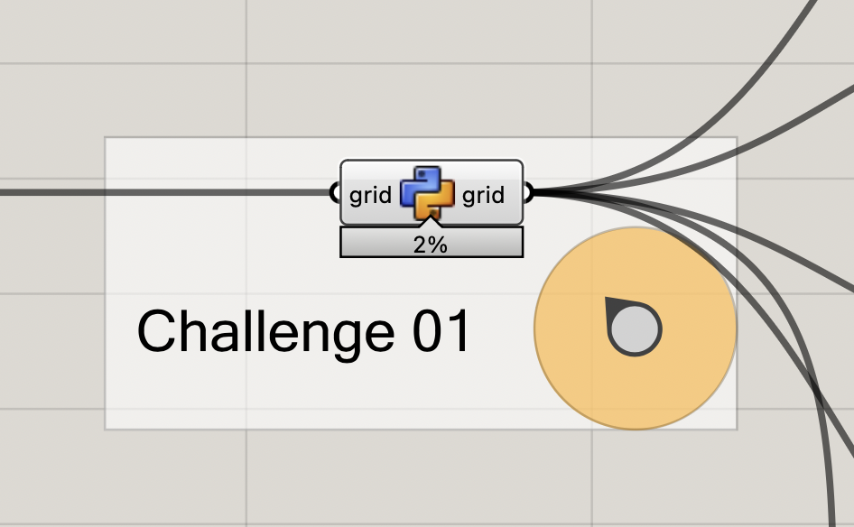
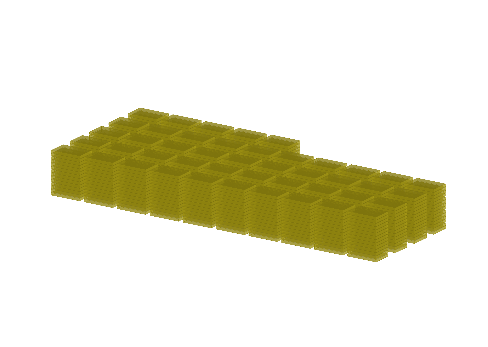

# Assignment 03

> Goal: apply object-oriented programming to the create slabs in our building grid.

We are picking up from where we left off in our last tutorial file of week 07 and expanding from there.
You can also include your custom filter from assignment 02 if you want although that doesn't change the grade.

The starting point for your assignment is this [Grasshopper definition](A03-building-grid-slabs_hs24.gh)

## Main task

Goal: Create slabs for our building grid.

A slab is represented visually as a box (using compas.geometry.Box).
The basic idea is to rely on volmesh to know where to add each slab.
We will create one slab per each face of our grid's volmesh if the face is 
aligned to the XY plane (ie. flat).

We will create a Slab class that will contain the attributes and methods of each slab.
The Slab class needs 3 attributes: `geometry` (a box), `category` (a string), and
the `halfface` id (an integer) from which we created the slab.
The attribute `category` will only be used if you tackle challenge 01.
Otherwise you can ignore it.

You may use your Brep filter from A02.

#### Details

The algorithm that we need to implement, as well as hints to functions you might need,
is in code comments, as a step-by-step guide.
<!--  -->

## Challenge 01

Goal: Assign the category of each slab

Each slab can be assigned one of three different categories: "roof", "floor_slab" or "bottom_slab". 

Depending on each category we want to visualize the slabs with a different color.

#### Details

The algorithm that we need to implement, as well as hints to functions you might need,
is in code comments, as a step-by-step guide.

<!--  -->

## Challenge 02

Goal: Visualize all the slabs in our building grid in a stacked or "palletized" version.

The idea is to take all the slabs that are created in the building, and 
make a copy of and visualize them in stacks of slabs, as if they were in
pallets for transportation.

#### Details

The algorithm that we need to implement, as well as hints to functions
you might need, is in code comments, as a step-by-step guide.

## Deliverables

One zip file [`mustermann_max_A-03.zip`] containing:

- Grasshopper File (`.ghx`):
  - File Name: `mustermann_max_A-03.ghx`
- Screenshots (`.png`):
  - File Name: `mustermann_max_A-03_xx.png`
  - Dimensions: 3200x2400 px
  - View: Parallel, Shaded
  - Screenshots of the main task and challenge 01, for challenge 02 is not relevant.

## Submission

Upload the assignment via Moodle.