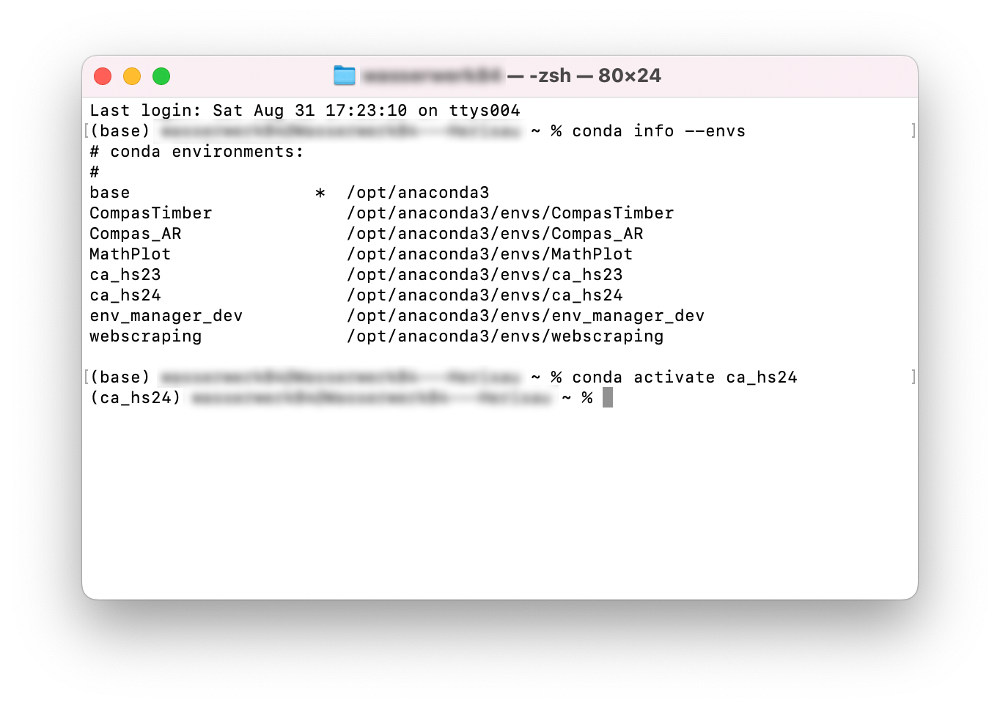

# Conda Tools
Conda is a package management system and environment management system for installing and managing software packages and dependencies. With conda you can create isolated "environments" with different python installations or other library installations without conflicts.

<p align="middle">

</p>

## COMPAS Environment Manager

To simplify the management of multiple COMPAS environments and different Rhino installations, we have developed a utility tool for quick environment switching. This tool recognizes all environments with COMPAS installed, provides information about the installed versions of Python and COMPAS, and allows for easy installation of relevant Grasshopper components. This is mainly intended for students who attend multiple courses involving COMPAS.


Please go to the [compas-switcher-1.0](/getting-started/conda-tools/compas-switcher-1.0) folder to find the appropriate version for your computer (Windows, Mac ARM, Mac Intel).

### Troubleshooting Compas Environment Manager

#### MacOS

We are aware that on MacOS some users have problems executing the file. This is due to Apples harsh restrictions regarding unsigned Applications. We are working on it!

In the meantime you can try to open a terminal and enter the following:

```
chmod +x /path/to/"SwitchUI_YourVersion"
```

#### Windows

On windows the tool should mostly work. If you get a message like
`'conda' is not recognized as an internal or external command, operable program or batch` it could mean that you haven't installed Conda to your PATH. Try the following in cmd:

```
SET CONDA_PATH=C:\custom\path\to\conda
```

## Manual Conda Interaction

Should you prefer to work with conda manually, which of course allows for more flexiblity and user control please refer to the following commonly used commands for working with Conda. Open the Conda command prompt on Windows or Terminal on Mac and execute the commands listed below.

<p align="middle">

</p>

### Basic Operations

#### List all available Conda environments:
```
conda info --envs
```
or
```
conda env list
```

#### Activate a specific environment:
```
conda activate <env_name>
```

#### Deactivate the current environment:
```
conda deactivate
```

#### Create a new environment:
```
conda create --name <env_name> python=3.x
```
Replace <env_name> with your desired environment name and 3.x with the desired Python version.

#### Remove an environment:
```
conda remove --name <env_name> --all
```

#### List all installed packages in the current environment:
```
conda list
```

### Renaming an environment

#### Clone Existing Environment 

Use the conda create command with the --name option to specify the new environment name and the --clone option to specify the existing environment:

```
conda create --name new_env_name --clone old_env_name
```

#### Remove the Old Environment

After verifying that the new environment works as expected, you can delete 
the old environment:

```
conda remove --name old_env_name --all
```

## Updating COMPAS

#### Activate your Environment

```
conda activate ca_hs24
```

#### Update COMPAS

```
conda update compas
```

---

<p align="middle">

</p>