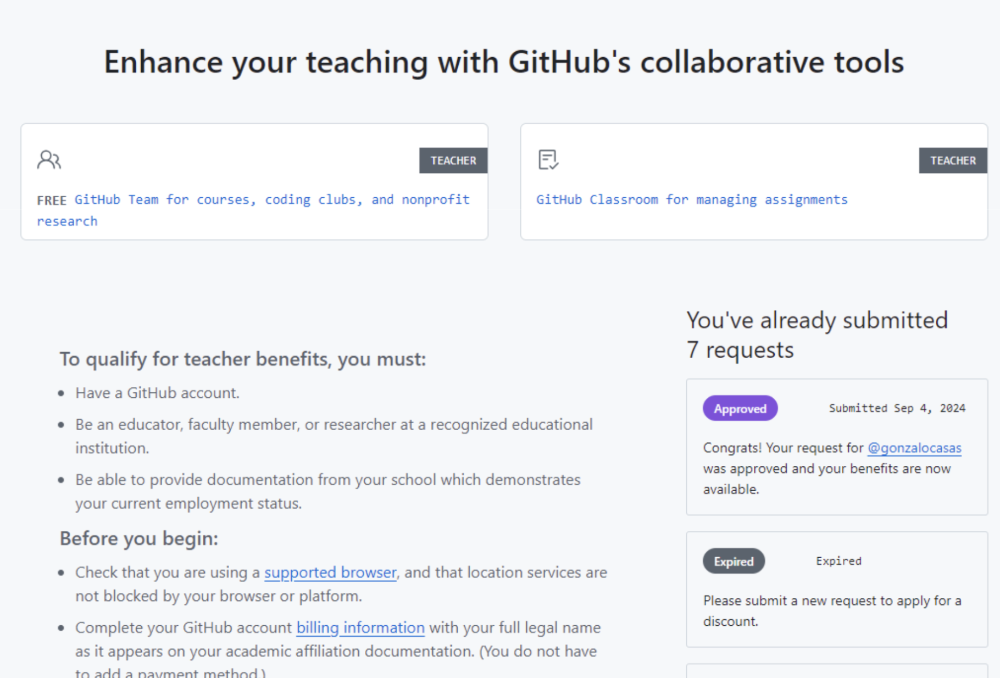

# Enable Github Copilot for free
GitHub Copilot (by GitHub & OpenAI): An AI coding assistant integrated into development environments, free for students, designed to help with code suggestions and completions.

You're entitled to access Github Copilot for free via the “Github Education” program in the role of student.

## Step-by-step

You will need your ETH card with the printed date clearly visible and in the future.

First, enable 2FA (2-factor authentication) on your github account. This is a prerequisite.  [More details here](https://docs.github.com/en/authentication/securing-your-account-with-two-factor-authentication-2fa/configuring-two-factor-authentication).

Then, [request academic benefits on this link](https://education.github.com/discount_requests/application):

The validation of academic credentials takes a few days, you can always see the status of your request on the same link, just scroll a bit down:

You might or might not be required to enter billing information, but don’t worry, you will not be charged anything.

Once the academic discount is approved, you can [enable Github Copilot on this link](https://github.com/settings/copilot). After that, you can start using Copilot. One of the most practical ways to integrate it is directly in the Visual Studio Code IDE, it basically comes down to installing the Copilot extension and logging in to your Github, but you can [find more information on this link](https://docs.github.com/en/copilot/using-github-copilot/getting-code-suggestions-in-your-ide-with-github-copilot).

---

