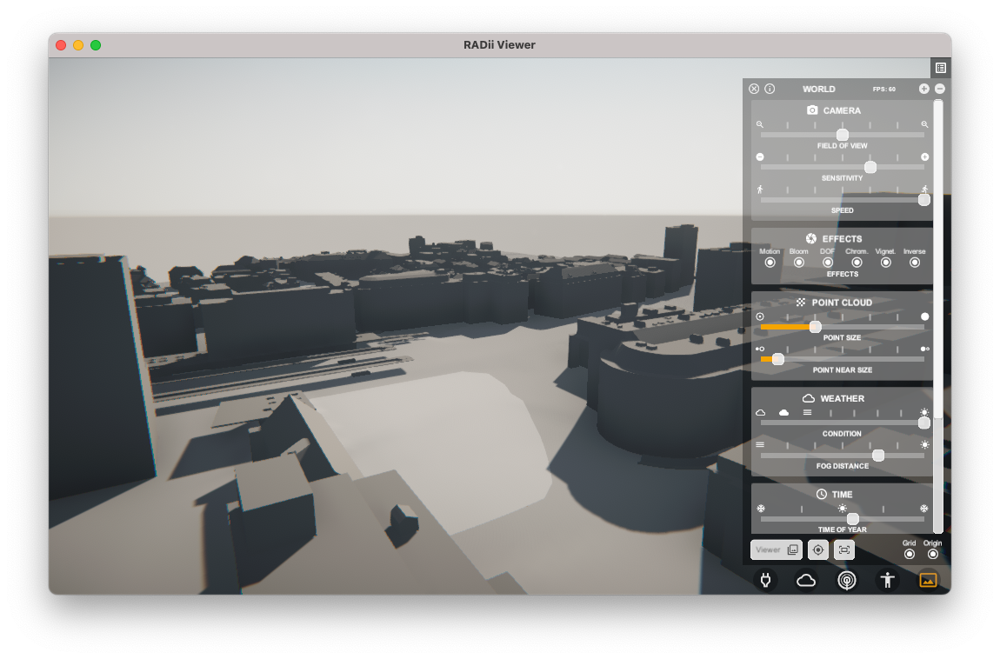
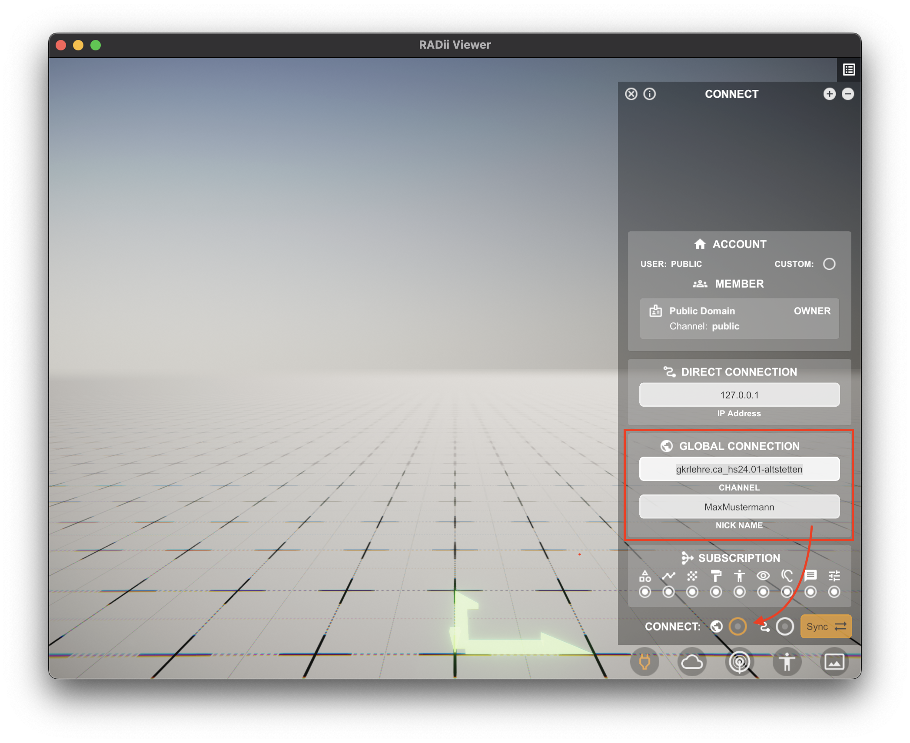
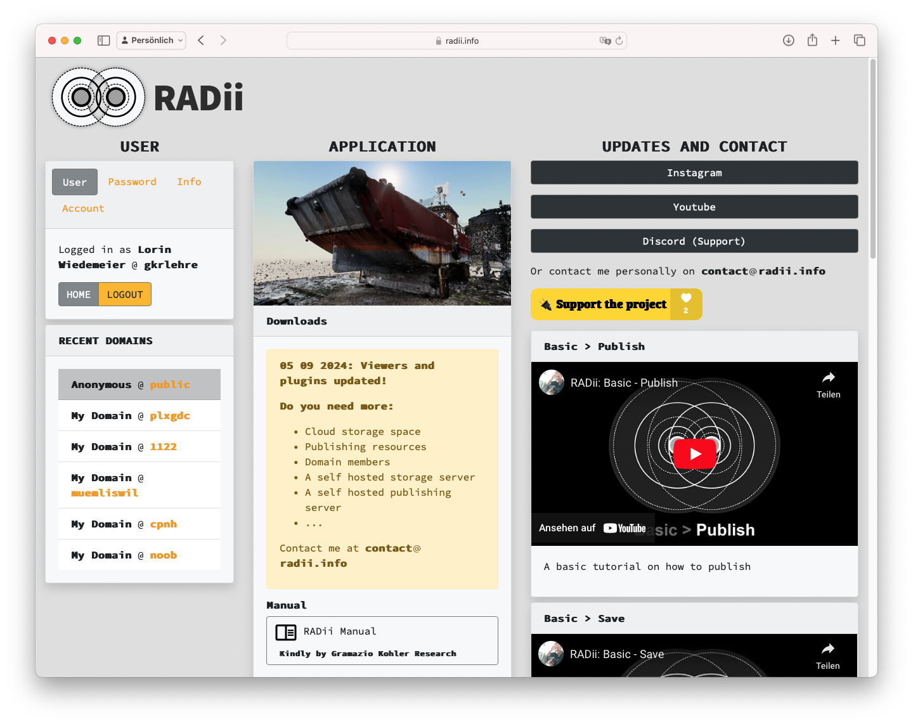
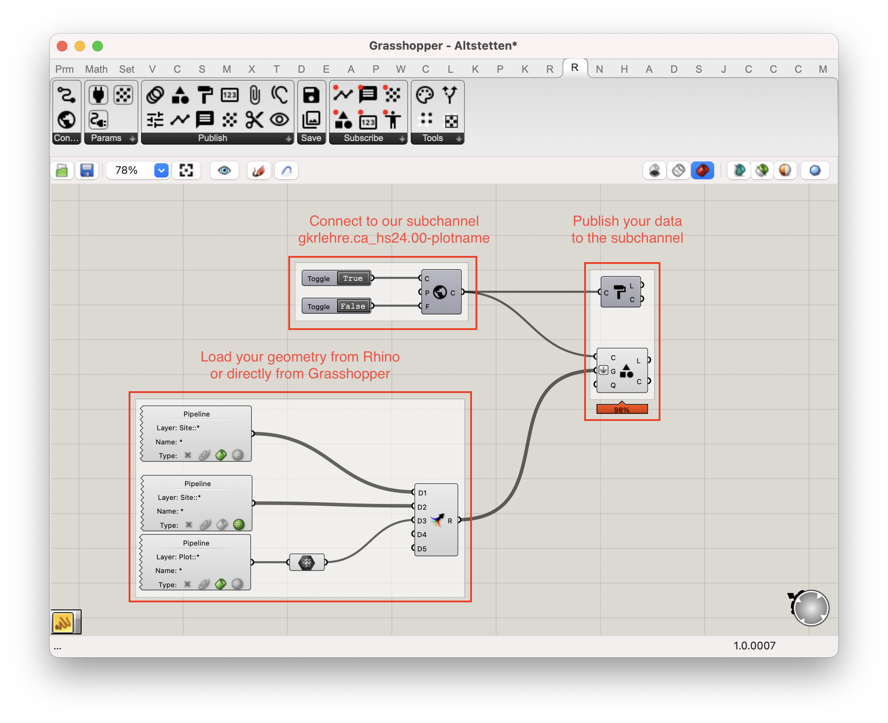
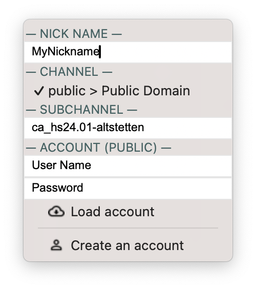
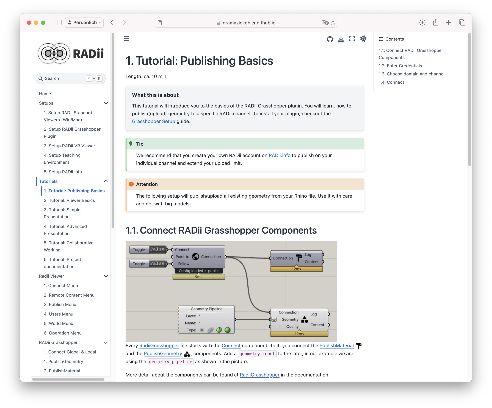

# RADII Introduction

Radii is a tool for real-time visualization and augmented reality (AR) integration within Rhino and Grasshopper. It allows us to interact with our designs in an immersive and intuitive way. In this course, we will provide a basic introduction to Radii, but we won't explore its full potential. We may dive deeper into its capabilities in Coding Architecture II.

For the final presentation, Radii will be used to explore your projects in an immersive and interactive manner, allowing each of you to join the channel on your own machine and explore the submissions.

The later exhibition will leverage more of radii's capabilities and will exhibit your projects in a virtual scaled model, accessible via your smartphone in augmented reality (AR).

### What do you need for the presentations?

For the final presentations you will only need to be able to **interact** with the **radii viewer** and **connect to our subchannels**, which is explained right below.. For those of you interested in more, feel free to read further and explore the full range of the tools capabilities.

## Radii Viewer
The Radii Viewer is a standalone desktop application that allows you to connect directly to channels or subchannels where geometry and scenes are published. After connecting to the channel, you can freely explore the published content in an immersive and interactive manner. This tool is essential for the final presentations, enabling you to interact with and present your projects effectively.

[Follow this tutorial](https://www.youtube.com/watch?v=6Lra3IDARNo&ab_channel=Archtica) to see how the basics are accomplished in the viewer.

### Download the viewer:

* **MacOS:** [Download here!](https://apps.apple.com/app/id1505325031)
* **Windows:** [Download here!](https://radii.info/download/standard/RADii%20Viewer%20Setup.zip)
* **iOS:** [Download here!](https://apps.apple.com/app/id1505325031)
* **Android:** [Download here!](https://play.google.com/store/apps/details?id=info.RADii.RADiiViewer)

### Connecting to a Subchannel

To connect to a subchannel, follow these steps:

1. Open the Radii Viewer application.
2. Navigate to the global connection settings.
3. Enter the channel.subchannel name using the following syntax: `gkrlehre.ca_hs24.subchannel`.

## Radii.info

If you want to explore further, visit the Radii.info website. Here, you can create an account which will enable you to publish geometry to both public and private channels.

[CLICK HERE to visit the website!](https://radii.info)

<!--  -->

There you'll also find the [documentation](https://gramaziokohler.github.io/radii_docs/tutorial/Quick_Guide/1_LV_Exploration_Grashopper.html).

## Radii Grasshopper Plugin

The Grasshopper Plugin is needed for publishing your own geometry directly from Rhino and Grasshopper to Radii. This plugin allows you to very smoothly integrate your design workflow with Radii's visualization. By using the GH Plugin, you can publish your geometry to specific channels or subchannels.

<!-- 

 -->

### Download the plugin from from here:

* Rhino 7 Win/Mac: [Download Here!](https://radii.info/download/plugin/R7/RADii.zip)
* Rhino 8 Win/Mac: [Download Here!](https://radii.info/download/plugin/R8/RADii.zip)

### First Steps with the GH Plugin

We recommend looking at the [Basic - Publish Tutorial](https://www.youtube.com/watch?v=Efk5rdFeWIA&ab_channel=Archtica) on Youtube.

## Documentation

[CLICK HERE to read the documentation](https://gramaziokohler.github.io/radii_docs/tutorial/Quick_Guide/1_LV_Exploration_Grashopper.html). 

---

