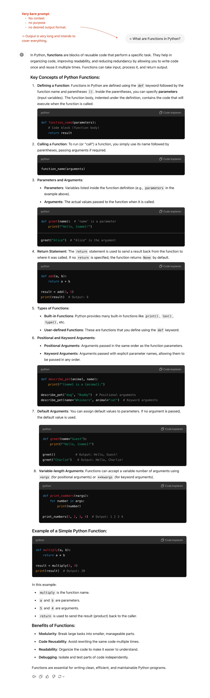
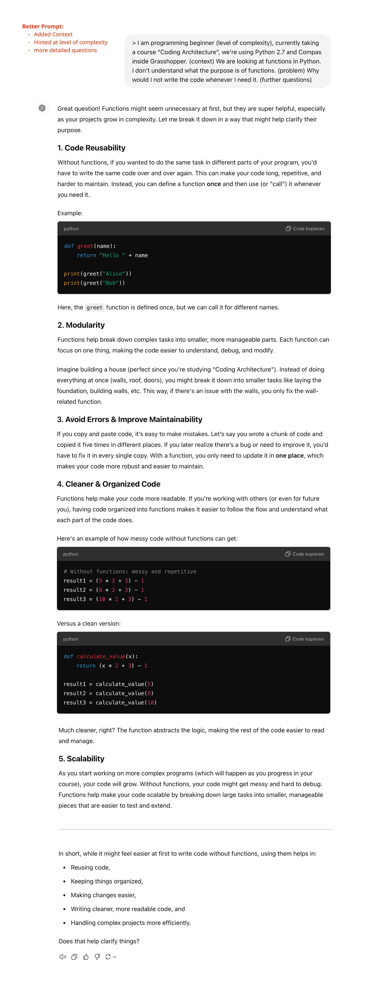
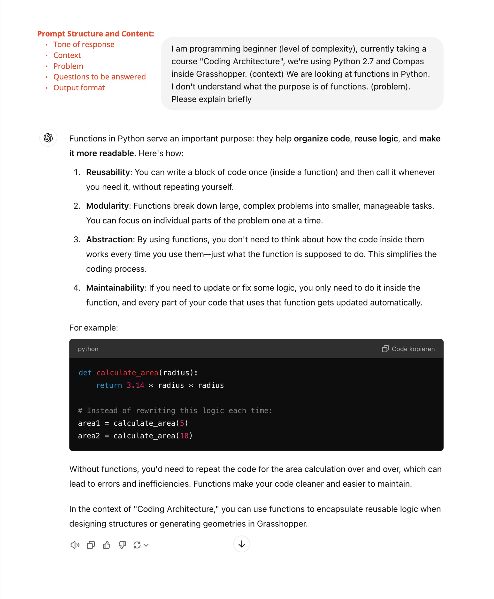
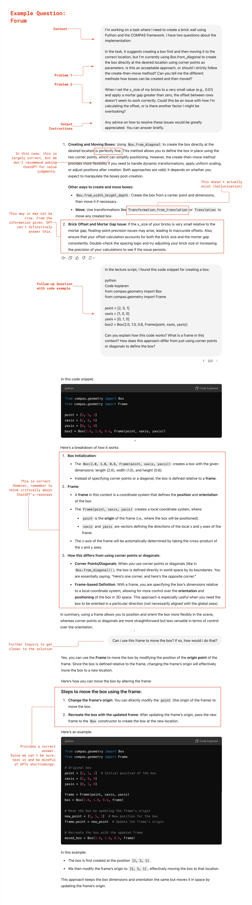
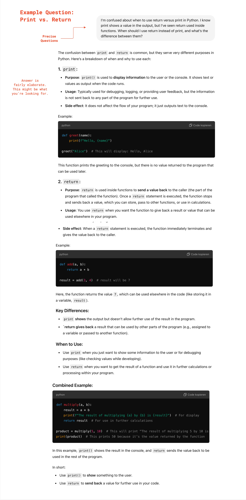
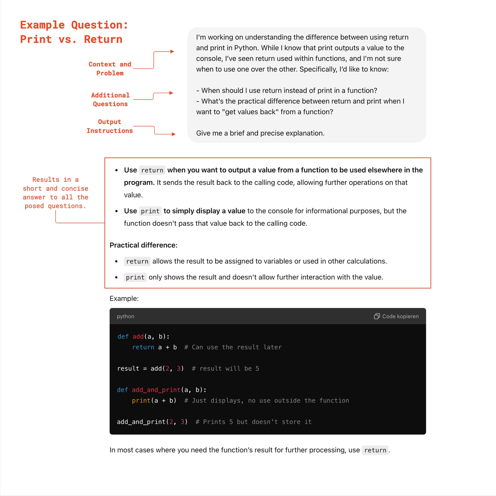
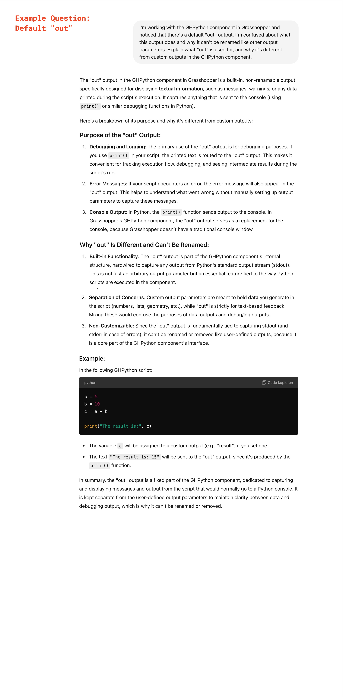
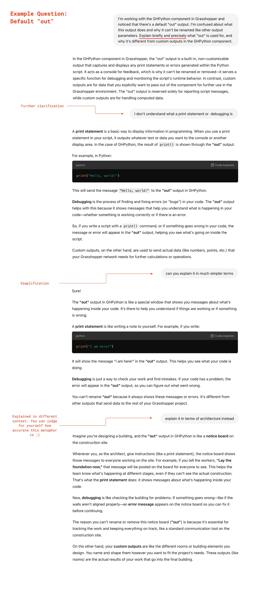
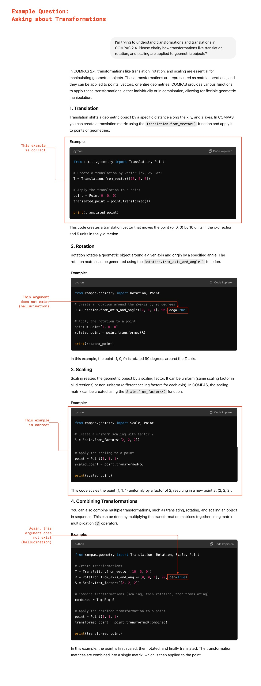

# GPT-Workshop: Part 1
ChatGPT, developed by OpenAI, is a language model that can generate human-like text based on user input. Most of the time, it is able to produce semantically coherent output in a vast variety of languages, including programming languages.

We are well aware that most of you likely already use ChatGPT. It definitely has the potential to enhance your learning experience by providing instant assistance and explanations on a wide range of topics. However, if not used carefully, GPT can also slow down or even hinder your learning process, or worst of all, leaving you not understanding its outputs. To help you make the most of this tool, we will provide some guidelines on how to use GPT effectively and productively, ensuring it supports rather than undermines your learning process.

In this first installment we'll be looking at the basics of how to use ChatGPT, look at strengths and weaknesses, and how to *engineer your prompts* to get useful answers.

## Table of Contents

* [Getting Started ](#getting-started)
* [Alternative LMMs](#alternative-lmms)
* [Strategies for Good Results](#strategies-for-good-results)
  + [Write clear instructions](#write-clear-instructions)
  + [Provide reference material](#provide-reference-material)
  + [Split complex tasks into simpler subtasks](#split-complex-tasks-into-simpler-subtasks)
  + [Verify Results](#verify-results)
* [Using GPT for Tutoring](#using-gpt-for-tutoring)
  + [Example Questions](#example-questions)

## Getting Started 

To use ChatGPT, visit the OpenAI website and sign up for an account. There are two versions available: a free version and a paid version called ChatGPT Plus.

- **Free Version**: Provides basic access to the model. It has usage limits and may be slower during peak times. The free version is available for *"unlimited"* use but has some restrictions.
- **ChatGPT Plus**: Costs around 20 CHF per month. This version uses OpenAI's most advanced model and can be used with practically no restrictions.

Both versions are capable of generating text and providing mostly accurate responses. However, while LLMs have improved a lot, they still have a tendency to generate fictional details.

## Alternative LMMs

### Text Generation

Besides ChatGPT there are many other LLMs at your disposal. While they differ on some aspects, we think any of them will serve you well. We happen to use ChatGPT as its the most commonly known one. 

* **GitHub Copilot** (by GitHub & OpenAI): An AI coding assistant integrated into development environments, free for students, designed to help with code suggestions and completions.
  * [Press here](/getting-started/github-copilot/README.md) to find out how you can use it as a student!
* **Claude** (by Anthropic): A conversational AI model focused on providing reliable, helpful, and safe responses, particularly emphasizing ethical AI usage.
* **Bard/Gemini** (by Google DeepMind): A conversational AI that incorporates real-time search capabilities and knowledge, designed to handle a wide range of tasks, with Gemini being its evolving successor.
* **LLaMA** (by Meta): An open-source language model that can be run locally, offering customizable models for various tasks without reliance on cloud-based services.
  * WizardCoder (community-driven): A specialized variant of language models optimized for coding tasks, designed to assist with code generation and debugging.

### Image Generation

AI-driven image generation tools allow you to create visual content based on text prompts. These tools have become very popular in recent years for their ability to produce unique images for art, design, and creative projects. Here are some key alternatives:

- **Stable Diffusion** (by Stability AI): An open-source image generation model that can be run locally, offering flexibility for developers and users to customize outputs.
- **DALL·E** (by OpenAI): A popular image generation model known for its ability to create highly detailed and creative visuals based on text descriptions.
- **Midjourney** (by Midjourney Labs): A web-based AI image generation tool that specializes in creating visually stunning and artistic images with a focus on unique aesthetics.

## Strategies for Good Results

GPT excels at organizing existing information into coherent text but struggles to generate new information. To achieve accurate results, it's important to formulate precise prompts. Using specific language, such as "3 units along x" instead of "more to the right," improves the model's understanding.

When dealing with complex problems, you should try to break them down into smaller, more manageable parts. Alternatively, GPT can help in breaking down the problem itself.

### Write clear instructions
ChatGPT can’t read your mind. If outputs are too long, ask for brief replies. If outputs are too simple, ask for expert-level writing. If you don't like the format, show it the format you’d like to see. The less it has to guess at what you want, the more likely you’ll get it.

* Include details in your prompt to get more relevant answers
* Ask the model to adopt a persona
* Clearly indicate distinct parts of the input (context, goal, desired output)
* Specify the steps required to complete a task (this also helps you break down the problem)
* Provide examples or files
* Specify the length or form of the output

| Bad                            | Better                  |
|-----                           |--------                 |
| How do I add numbers in Excel? | How do I add up a row of CHF amounts in Excel? I want to do this automatically for a whole sheet of rows with all the totals ending up on the right in a column called "Total".                   |
| Who’s Bundesrat?              | Who was the Bundesrat of Switzerland in 2010, and how frequently are elections held?                             |
| Write code to calculate the Fibonacci sequence. | Write a Python function to efficiently calculate the Fibonacci sequence. Comment the code liberally to explain what each piece does and why it's written that way. Explain your steps and thoughs along the way.      |
| Summarize the meeting notes.  | Summarize the meeting notes in a single paragraph. Then write a markdown list of the speakers and each of their key points. Finally, list the next steps or action items suggested by the speakers, if any. |

### Provide reference material

Language models can confidently invent fake answers (hallucinations), especially when asked about niche topics or for citations, URLs, Books or Projects. Use your intuition to guess whether or not ChatGPT can give you sensible answers on a given Topic. *It will be able to give details on the life and work of Mies van der Rohe, but it will struggle to do the same about Mike Guyer.*

- Tell ChatGPT to answer using a reference text
- Tell ChatGPT to answer with citations from a reference text

### Split complex tasks into simpler subtasks

Complex tasks tend to have higher error rates than simpler tasks. Try to break down a problem into smaller steps, or have GPT do it for you.

- Think about the steps you would take to solve the problem.
- Ask it to attempt to break down the problem itself.
- Summarize long documents piecewise and construct a full summary recursively

### Verify Results

It is important to critically reflect the output provided by GPT and not blindly trust it. When using GPT to generate code, you should carefully review it and try to understand the generated code, rather than blindly copying it. If clarification is needed, ask for it.

Luckily, the quality of the generated code can also be tested easily by checking if it behaves as intended. Still, the efficiency and simplicity of the code can be off, as GPT might use advanced programming concepts that you might not be familiar with. If that happens, ask it to rewrite the code in a beginner-friendly way.

## Using GPT for Tutoring

Following you'll find some examples we have prepared, based mostly on your questions so far. These are to hightlight both the strengths and weaknesses of ChatGPT. While its answers tend to be useful, the model will dream up details, when asked about niche topics.

<!-- ### Prompt Optimization

The goal is to get answers in a format and length that you can work with best. So we want to specify as much as possible to get exactly the response we're looking for

  
<b> Minimalist Prompt </b>

  Here you see a very bare prompt. Lacking context, purpose or any other specifications. Therefore ChatGPT will try to cover everything and will output a long-winded answer. It will assume a level of knowledge and use language accordingly.

  
<b> Better Prompt </b>

  
<b> Good Prompt </b>

 -->

### Example Questions

  
<b> Student Forum Question </b>

  
<b> Print vs. Return </b>

  
<b> Print vs. Return (optimized) </b>

  
<b> Default "out" </b>

  
<b> Default "out" (optimized) </b>

  
<b> Explanation of Transformations </b>

---

