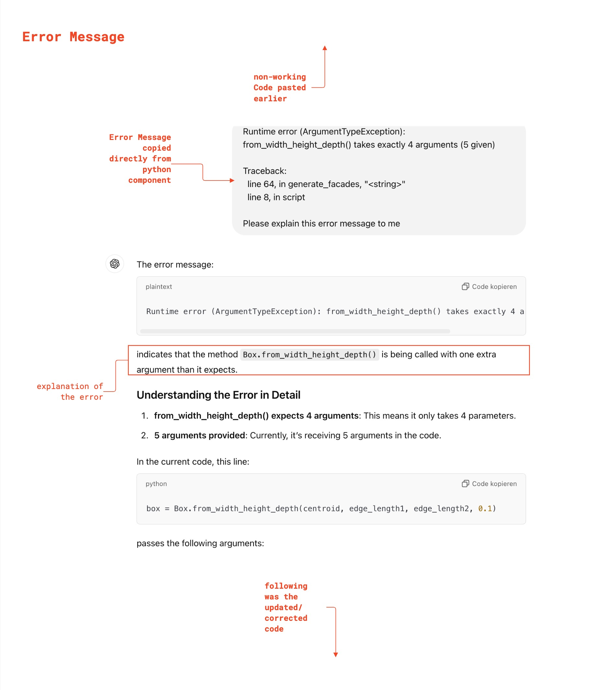
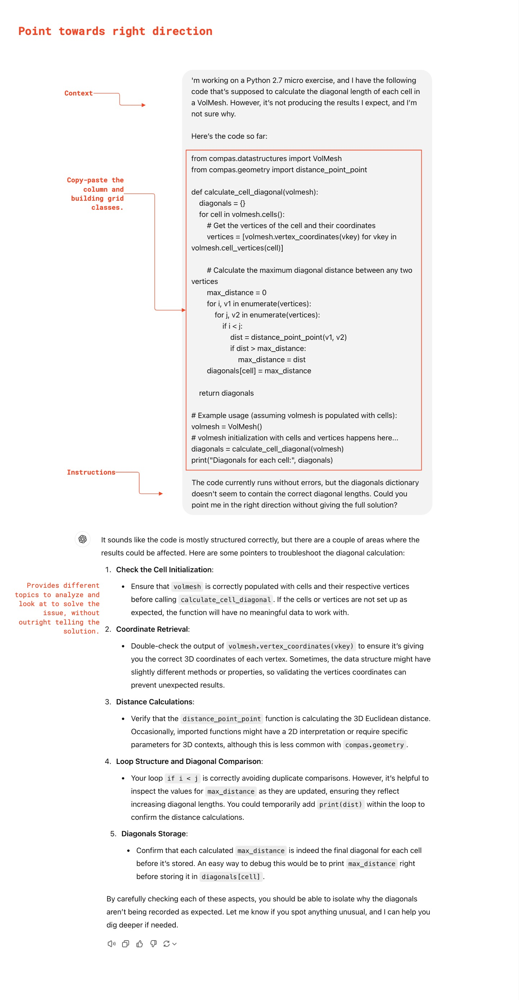
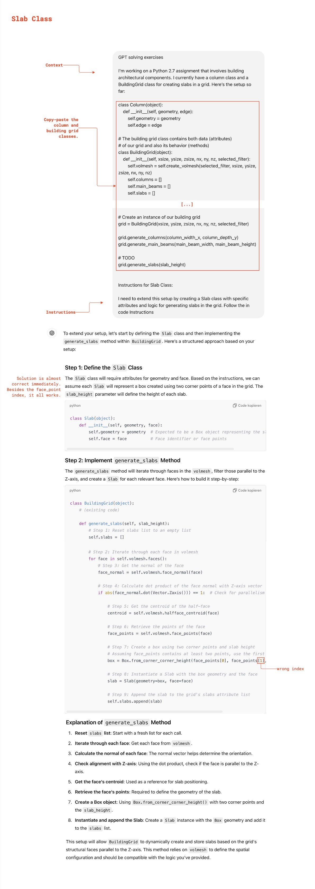
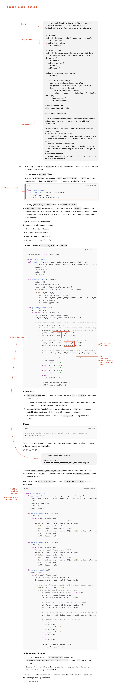

# GPT-Workshop: Part 2

In this second part of the GPT Workshop, we aim to leverage the full potential of language models for more advanced coding tasks. Today, we’ll focus on two main areas: debugging and solving exercises using GPT effectively. This session will build on the basics we discussed in Part 1.

We know that many of you already use GPT this way, but there are some best practices that can help you get even more out of it — while ensuring that you fully understand each step of the solution..

## Table of Contents

* [Using GPT for Debugging ](#using-gpt-for-debugging)
* [Using GPT for Solving Exercises](#using-gpt-for-solving-exercises)
* [Example Conversations](#example-conversations)

## Using GPT for Debugging

Debugging code can be difficult as a beginner, especially when errors are unclear or nested in complex functions. GPT can be very helpful for identifying, explaining, and even correcting errors. Here are some methods to use GPT for debugging:

### Techniques for Debugging with GPT

- **Locating Bugs/Errors:** If you're unsure where a bug/error is, paste your code and ask GPT to help find any potential issues. E.g, *“I’m getting an error in this code. Where is it?.”*

- **Error Message Analysis:** You can provide specific error messages to GPT and ask for clarification. For example, *“I received the following error message (Paste message here). What is wrong?”* or, *“I’m getting an IndexError when running this code. Could you explain what it means and how to resolve it?”*

- **Pointing in the Right Direction without Providing Full Solution:** You might want to preserve the challenge of solving the problem yourself, in which case you can ask GPT to give you hints or explain possible solutions without giving the exact code. For example, *“Something in my code is not working. Can you point me in the right direction without giving me the solution?”*

- **Breaking Down Complex Problems:** If your code is getting too complicated for your own understanding, GPT can break down each part one at a time. For example, *“This code has multiple parts. Can you break it down for me?”*

- **Debugging Logs and Comments:** GPT can help you generate debug print statements or comments to see values or steps throughout the code. This makes finding bugs easier, especially for complex tasks.

### Tips for Effective Debugging Prompts

- Provide clear context about the error and where it appears.
- Include the error message or specific behavior that’s problematic.
- If applicable, explain any expected vs. actual outcomes you’re observing.
- Ask GPT to help you examine specific parts of your code if it’s complex.

## Using GPT for Solving Exercises

GPT is great for helping solve exercises, but using it well is key to learning effectively. Here are some tips for leveraging GPT to solve exercises without losing the opportunity to understand the code thoroughly:

### Strategies for Using GPT to Solve Exercises

- **Break Down the Problem First:** Before asking GPT for help, try to break down the exercise into smaller tasks. For example, “This exercise requires finding the maximum value in a list and then calculating the average. Could you show me how to do each step?”

- **Ask GPT to Explain the Solution Step-by-Step:** When GPT provides a solution, ask it to explain each part so you understand the reasoning. For example, “I see the code you provided, but could you explain why each step is needed?”

- **Limitations:** Since COMPAS is not as well known as other libraries, GPT tends to struggle a bit with obscure methods. Usually if you look up the method yourself in the API ref GPT will understand and apply correctly.

## Example Conversations

  
<b> Analysing Error Message </b>

  
<b> Pointing Towards Direction </b>

  
<b> Solving Slab Exercise </b>

  
<b> Solving Facade Exercise </b>

---

