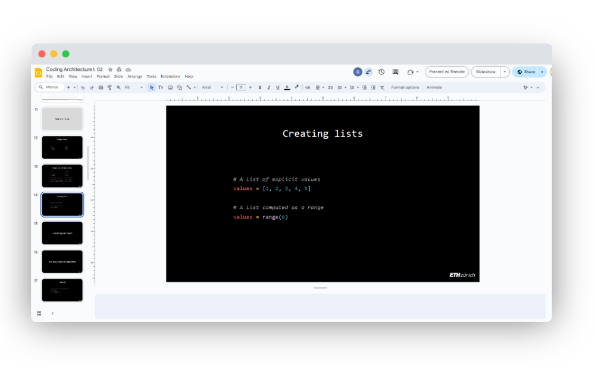
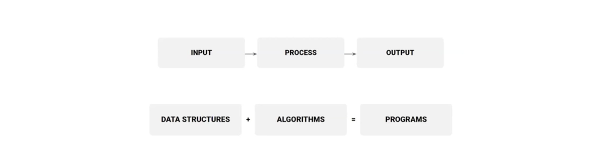

# Coding Architecture I: HS24

## Week 03 - Recap


## Table of Contents

- [Overview](#overview)
- [Slides](#slides)
- [Recap](#recap)
   - [What is code?](#what-is-code)
   - [Python Recap](#python-recap)
      - [Basics](#basics)
      - [Control Structures and Functions](#control-structures-and-functions)
      - [Lists and Relatives](#lists-and-relatives)
- [Computational Geometry](#computational-geometry)
   - [COMPAS](#compas)
   - [Geometry types](#geometry-types)
   - [Geometric Datastructures](#geometric-datastructures)
- [How to read technical documentation](#how-to-read-technical-documentation)
- [Assignment 1](#assignment-1)
   - [Brick Wall](#brick-wall)
- [Code Examples](#code-examples)
- [Micro exercises](#micro-exercises)

## Overview

This week’s lecture will serve as a recap of the foundational concepts we've covered in the previous two weeks. We'll start by revisiting key topics such as data types, variables, lists and sets, and how these concepts form the backbone of computational design in Python. We'll also review how to use lists and loops to generate and manipulate geometric objects within Grasshopper and Rhino, bridging the gap between code and design.

Following the recap, we'll introduce the next practical exercise, where you get to use your knowledge of loops, lists and geometry, with a focus on using nested loops and conditionals to control geometry in a more refined way.

> **Learning Goals:** Strengthen your grasp of foundational Python concepts, such as loops, lists, geometry, and apply them to generate dynamic geometric structures.


## Slides

[](https://docs.google.com/presentation/d/1_-0B7SFFeyJSq8j8jR_cjlv_FGDILc52XKKYfYtopnI/edit?usp=sharing)

<div style="display: flex; justify-content: center; align-items: center; height: 1vh;">
    <p style="font-size: 75%;">
        ↑ click to open ↑
    </p>
</div>

## Recap

In the first lecture, we covered the essentials of Python programming, focusing on key data types such as integers, floats, strings, and booleans. These fundamental types are used in expressions and statements to perform operations and assign values to variables.

We examined control structures, specifically conditional statements (`if`, `else`) to make decisions in code, and loops (`for`, `while`) for repetitive tasks, particularly when dealing with collections of data. Functions were introduced to enable code modularity, allowing sections of code to be reused with defined parameters and return values.

In the second lecture we looked at important data structures:

- Lists: Ordered collections of items, useful for storing and manipulating multiple values. We reviewed methods to modify lists such as append, pop, and sort.
- Sets: Unordered collections that automatically remove duplicates, useful for set operations like union, intersection, and difference.
- Dictionaries: Key-value pairs, providing efficient data storage and quick access to information based on unique keys.

In addition, we introduced the COMPAS framework for working with geometric objects in Python, covering basic methods for creating and manipulating geometric data within the context of computational design.

Additionally, the idea that everything in Python is an object was briefly introduced.
This idea together with the more general concepts of object-oriented programming (OOP)
will be introduced in more detail in the following weeks.

Key Concepts covered so far: 

- **Data Types:** Integers, floats, strings, booleans.
- **Expressions and Statements:** Mathematical and logical operations, assignment statements.
- **Functions:** Defining, calling, and returning values from functions.
- **Control Structures:** Using loops (`for`/`while`) and conditionals (`if`/`else`) to control program flow.
- **Lists:** Ordered, mutable collections, with operations like append, pop, insert, and slicing.
- **Sets:** Unordered, unique collections, useful for operations like union, intersection, and eliminating duplicates.
- **Dictionaries:** Key-value pairs that allow for efficient, structured data storage and access.
- **Loops:** Iterating through collections for data processing and manipulation.
- **COMPAS Geometry:** Generating and manipulating basic geometric objects like points and boxes programmatically.

### What is code?

At its core, software can be understood as a tool for transforming data.

> Input → Process → Output

> Data + Algorithms = Software



### Python Recap

#### Basics

```python
# -----------------------------------
# ----------- Data Types ------------

# Integer
integer_example = 42

# Float
float_example = 4.2429

# String
string_example = "42"
string_example_2 = "Hello World"

# Boolean
boolean_example = True

# ------------------------------------
# ----------- Expressions ------------

# Expressions are combinations of values, variables, and operators that are evaluated to produce another value.

# Basic Arithmetic
addition = 3 + 2            # Output: 5
subtraction = 10 - 5        # Output: 5
multiplication = 4 * 3      # Output: 12
division = 20 / 4           # Output: 5.0

# Combining variables in an expression
result = addition * subtraction  # Output: 25

# Mathematical operations can also involve floats
float_result = float_example / 2  # Output: 2.12145

# --------------------------------------
# --------- Assignment Statements ------

# Assigning a value to a variable
a = 10  # a now holds the value 10

# Assigning the result of an expression
b = a * 2  # b now holds the value 20

# Assignment statements allow us to store and reuse values in our code
c = b + 5  # c now holds the value 25
```

#### Control Structures and Functions

```python
# -------------------------------------
# ----------- Control Flow ------------

# Control flow allows you to direct the order in which statements are executed.

# Conditional (if-else) statements
x = 10
if x > 5:
    print("x is greater than 5")  # Output: "x is greater than 5"
else:
    print("x is not greater than 5")

# -----------------------------------
# -------------- Loops --------------

# For loop: Repeat a block of code for each element in a list
numbers = [1, 2, 3, 4]
for number in numbers:
    print(number)

# Output: 1, 2, 3, 4

# While loop: Repeat a block of code as long as a condition is true
count = 0
while count < 5:
    print(count)
    count += 1

# Output: 0, 1, 2, 3, 4

# -----------------------------------
# ----------- Functions -------------

# Functions allow you to group code into reusable blocks

# Defining a function that adds two numbers
def add_numbers(a, b):
    return a + b

# Calling the function
sum_result = add_numbers(5, 10)  # Output: 15
```

#### Lists and Relatives

```python
# -----------------------------------
# -------------- Lists --------------

# Lists are ordered collections of items. They are mutable, meaning their contents can be changed.

# Defining a list
fruits = ["apple", "banana", "cherry"]

# Accessing items in a list
print(fruits[0])  # Output: "apple"

# Adding an item to the list
fruits.append("orange")

# Removing an item from the list
fruits.remove("banana")

# -------------------------------------
# ----------- Dictionaries ------------

# Dictionaries store data in key-value pairs. Keys are unique, and values can be any data type.

# Defining a dictionary
person = {"name": "Alice", "age": 30, "city": "New York"}

# Accessing values by key
print(person["name"])  # Output: "Alice"

# Adding or updating key-value pairs
person["profession"] = "Architect"
print(person)  # Output: {'name': 'Alice', 'age': 30, 'city': 'New York', 'profession': 'Architect'}
```

## Computational Geometry

Computational Geometry is a branch of computer science and mathematics that focuses on the design and analysis of algorithms to solve geometric problems. It plays a critical role in fields like architecture, CAD (Computer-Aided Design), and 3D modeling, where geometric objects such as points, lines, and surfaces need to be represented, manipulated, and analyzed.

In architecture and design, computational geometry allows for the creation of complex forms, parametric modeling, and geometric transformations that are difficult or impossible to achieve manually. This is where frameworks like COMPAS come into play.

### COMPAS

COMPAS is an open-source framework for computational research and design in architecture, engineering, and construction. It provides tools for working with geometry, data structures, and computational algorithms, making it a valuable resource for both research and design.

Features of COMPAS:

- Geometry Handling: Tools to define and manipulate geometric objects such as points, lines, surfaces, and meshes.
- Data Structures: Support for handling complex data like graphs, meshes, and volumes.
- Interoperability: Integrates with Rhino, Grasshopper, Blender, and other design platforms.
- Extensibility: Supports custom algorithms, and works well with Python libraries.


### Geometry types

```python
# --------------------------------
# ------------ Points ------------

# A Point is the most basic geometric entity in computational geometry. Defined by its coordinates in 2D or 3D space, points are used to describe the positions of vertices or other objects in the design space.

from compas.geometry import Point
p1 = Point(1, 2, 0)
p2 = Point(3, 4, 0)


# --------------------------------
# ------------ Boxes -------------

# A Box is a geometric object defined by 3 dimensions in X, Y and Z axes, and optionally a frame (ie. position and orientation).

# A simple box
from compas.geometry import Box

box1 = Box(2.0, 1.0, 0.6)


# A box with a frame centered at x=2, y=5, z=1
from compas.geometry import Box
from compas.geometry import Frame

point = [2, 5, 1]
xaxis = [1, 0, 0]
yaxis = [0, 1, 0]
box2 = Box(2.0, 1.0, 0.6, Frame(point, xaxis, yaxis))

# --------------------------------
# ------------ Lines -------------

# A Line is a geometric object defined by two points. Lines are often used to define edges, axis, or paths in a design.

from compas.geometry import Line
line = Line(p1, p2)


# ---------------------------------
# ------------ Curves -------------

# Curves represent more complex geometric paths. Unlike straight lines, they 
# involve control points and can represent splines, arcs, or other smooth, non-linear paths.

from compas.geometry import Bezier
curve = Bezier([p1, p2, Point(5, 6, 0)])
```

### Geometric Datastructures

```python
# --------------------------------
# ------------ Graph  ------------

# A Graph is a collection of nodes (vertices) connected by edges. It is used 
# to represent relationships between objects in a structure.
# It does not have visual representation by default.

from compas.datastructures import Graph
graph = Graph()

# Add vertices and edges
graph.add_node('A')
graph.add_node('B')
graph.add_edge('A', 'B')

# --------------------------------
# ------------ Mesh --------------

# A Mesh is a collection of vertices, edges, and faces that define a 3D surface.
# Meshes are often used to model architectural surfaces or structural elements.

from compas.datastructures import Mesh
mesh = Mesh()

# Add vertices and faces to the mesh
mesh.add_vertex(x=0, y=0, z=0)
mesh.add_vertex(x=1, y=0, z=0)
mesh.add_vertex(x=1, y=1, z=0)
mesh.add_face([0, 1, 2])

# --------------------------------
# ----------- VolMesh ------------

# A VolMesh is a volumetric mesh composed of cells, faces, and vertices. 
# It is used for representing 3D structures with volume, often used in 
# structural analysis.

from compas.datastructures import VolMesh
volmesh = VolMesh.from_meshgrid(nx=10)
```

### Collection of Geometric Types

```python
# -----------------------------------------
# ----------- 2D List of Points -----------

from compas.geometry import Point

points = []

for x in range(10):
    for y in range(10):
        p = Point(x, y, 0)
        points.append(p)

# ------------------------------------------
# ----------- with Conditionals ------------

from compas.geometry import Point

points = []

for x in range(10):
    from compas.geometry import Point

    points = []

    for x in range(10):
        if x % 2 != 0:
            for y in range(10):
                p = Point(x, y, 0)
                points.append(p)

# -----------------------------------------
# ----------- 2D Wall of Points -----------

from compas.geometry import Point

points = []

for x in range(10):
    for z in range(10):
        p = Point(x, 0, z)
        points.append(p)

# ----------------------------------------
# ----------- 2D Grid of Boxes -----------

from compas.geometry import Point
from compas.geometry import Box

points = []

for x in range(10):
    for y in range(10):
        p = Point(x, y, 0)
        points.append(p)

boxes = []

for point in points:
    box = Box(point, 1, 1, 1)
    boxes.append(box)
```

## How to read technical documentation

When working with a new library of framework, understanding how to read its technical documentation is crucial for effectively using its features and capabilities. This documentation is often referred to as an "API reference", which stands for Application Programming Interface reference.

An API (Application Programming Interface) reference is a detailed guide that describes the available classes, functions, methods, and data types provided by a software library or framework. It serves as a resource for developers to understand how to interact with the library and utilize its features in their projects.

In the case of the COMPAS framework, the API reference is organized into various modules (or chapters), each representing different functionalities provided by the framework. Here's a breakdown of how to navigate and use the API reference effectively


The left panel of the API reference typically lists the available modules, which represent different parts of the library. For COMPAS, some of the key modules include among others:

- `compas`: The core module, containing general-purpose tools and utilities.
- `compas.geometry`: A collection of tools and functions for working with computational geometry, such as points, lines, curves, and transformations.
- `compas.datastructures`: This module focuses on managing and manipulating geometric data structures like graphs, meshes, volumetric meshes, etc.

Each module contains a set of classes, functions, or constants grouped by related functionality. Clicking on a module in the left panel will display its specific content in the right panel, where you'll find detailed information on the selected item.

The right panel displays the documentation for a specific class or function. Here’s what you’ll typically find in the detailed view:

- Class or Function Name: This is the title of the specific item you are viewing, such as Point or Mesh.
- Description: A concise explanation of what the class or function does, outlining its purpose and potential use cases. This section helps you understand the function's role within the framework.
- Parameters: A list of inputs that the function or method requires. Each parameter is described with its name, type, and a brief explanation of its purpose.
- Return Value: This section explains what the function returns once executed, including the type of data returned (e.g., a Mesh, a float, etc.) and its structure.
- Methods (for classes): If you are looking at a class, this section lists the methods (or functions) available within that class. Each method will include descriptions of what it does, its parameters, and what it returns.
- Usage Example: Many API entries include a code example showing how to use the class or function in a real-world scenario. These examples are crucial for understanding how to implement the functionality correctly.

### Importing from COMPAS

In Pyhton we can import entire libraries:

```python
import compas
```

or we can import specific classes or methods:

```python
from compas_rhino.conversions import point_to_rhino
rhino_point = point_to_rhino(p1)
```

## Assignment 1


### Brick Wall

The assignment of this week could be considered the hello world of parametric design! We will create a parametric brick wall using Python and the COMPAS framework.

Click the link [here](/assignments/A01-brick-wall/README.md) to learn the details of assignment 1.

## Code Examples

The following files are useful to follow the lecture content:

- [Grasshopper/Python basics III](./examples/01-grasshopper-python-basics-iii_hs24.gh)

## Micro exercises

The following are very simple micro exercises that you can go through to practice some of the concepts of the current lecture. Each of them should not take more than 5 minutes to complete. They are completely optional.

1. In a GHPython component, use a `for` loop to create a list of 10 or more points along the X axis. Use a fixed value for Y and Z, e.g. 0, 0. Assign the list to an output parameter (eg. `a`). Use the `Draw` component of COMPAS to visualize the output.

2. In a GHPython component, use a nested `for` loop to create a list of points in a grid. The grid should be 10x10 points. Use a fixed value for Z, e.g. `0`. Assign the list to an output parameter (eg. `a`). Use the `Draw` component of COMPAS to visualize the output.

3. In a GHPython component with two inputs `nx` and `ny`, repeat the previous exercise, but allow the size of grid to be configurable using sliders to define `nx` and `ny`. Take care of selecting the right "type hint", otherwise Grasshopper will not be happy.

4. In a GHPython component with two inputs `nx` and `ny`, repeat the previous exercise, but add a conditional statement inside the `for` loop to only append points to the list if the X coordinate is even.

5. In a GHPython component with two inputs `nx` and `ny`, repeat the previous exercise, but change the conditional statement to only append points that form diagonal lines (ie. the sum of x and y is even).

6. In a GHPython component with two inputs `nx` and `ny`, repeat the previous exercise, but instead of adding the condition inside the `for` loop, create a user-defined function that accepts `x`, `y`, `z` parameters and returns `True` or `False`. Use the function inside the `for` loop to decide whether to append the point to the list or not.

7. In a GHPython component with two inputs `nx` and `ny`, repeat the previous exercise, but use the `product` function of the `itertools` module instead of using nested `for` loops.

<details>
  <summary><b>Solutions</b></summary>

1.

```python
from compas.geometry import Point

a = []
for x in range(10):
    a.append(Point(x, 0, 0))
```

2. 

```python
from compas.geometry import Point

a = []
for x in range(10):
    for y in range(10):
        a.append(Point(x, y, 0))
```

3. 

```python
from compas.geometry import Point

a = []
for x in range(nx):
    for y in range(ny):
        a.append(Point(x, y, 0))
```

4. 

```python
from compas.geometry import Point

a = []
for x in range(nx):
    for y in range(ny):
        if x % 2 == 0:
            a.append(Point(x, y, 0))
```

5. 

```python
from compas.geometry import Point

a = []
for x in range(nx):
    for y in range(ny):
        if (x + y) % 2 == 0:
            a.append(Point(x, y, 0))
```

6. 

```python
from compas.geometry import Point

def is_diagonal(x, y, z):
    return (x + y) % 2 == 0

a = []

for x in range(nx):
    for y in range(ny):
        if is_diagonal(x, y, 0):
            a.append(Point(x, y, 0))
```

7.

```python
from compas.geometry import Point
from itertools import product

a = []

for x, y in product(range(nx), range(ny)):
    if (x + y) % 2 == 0:
        a.append(Point(x, y, 0))
```

or including the function

```python
from compas.geometry import Point
from itertools import product

def is_diagonal(x, y, z):
    return (x + y) % 2 == 0

a = []

for x, y in product(range(nx), range(ny)):
    if is_diagonal(x, y, 0):
        a.append(Point(x, y, 0))
```


</details>

---

<p align="middle">

</p>