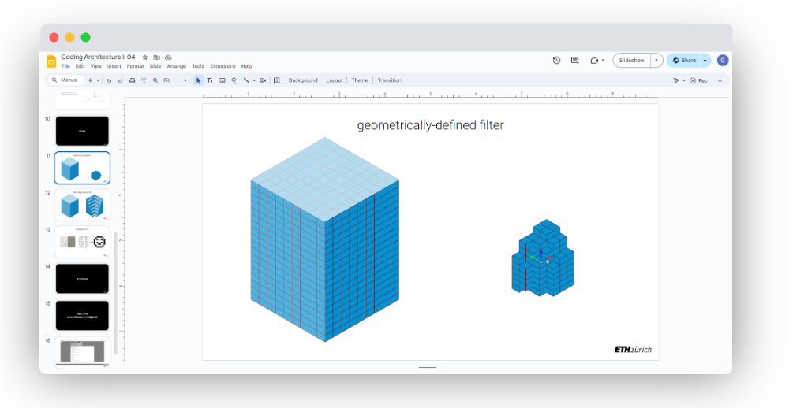

# Coding Architecture I: HS24

## Week 04 - Geometry and Filtering


## Table of Contents

* [Overview](#overview)
* [Slides](#slides)
* [Geometric Types: Frames / Coordinate Systems](#geometric-types--frames---coordinate-systems)
    + [Basic Constructor](#basic-constructor)
    + [Frames and Geometry](#frames-and-geometry)
    + [Frames and Transformations](#frames-and-transformations)
* [Working with Geometric Types](#working-with-geometric-types)
    + [Constructors](#constructors)
    + [Attributes](#attributes)
    + [Methods](#methods)
* [Filtering](#filtering)
    + [Basics](#basics)
    + [Different Filtering methods](#different-filtering-methods)
* [GPT-Workshop: Part 1](#gpt-workshop--part-1)
* [Code Examples](#code-examples)

## Overview

This week’s lecture will be a wrap-up aimed at consolidating your understanding of the key concepts covered so far. Before we dive into Object-Oriented Programming next week, we’ll take the opportunity to finish our exploration of geometric types and provide additional time for everyone to catch up. Today we'll cover:

- Geometric Types: We'll finish up our discussion on geometric types, specifically focusing on constructors, methods, and attributes
- Frames: We'll look at frames, what they are and how we use them to position and orient geometry in space.
- Advanced Filtering Techniques: We’ll introduce new ways to filter geometric data using a variety of methods, including random filters, modulo conditions, spherical filtering, and more complex mathematical and geometry-based filtering.
- GPT Workshop (Part 1): A short workshop on using GPT effectively for coding assistance, with tips on how to formulate questions for better answers.
- Tutored Session: The final part of the lecture will be a hands-on session where you'll have time to ask questions and get help with your work.

>**Learning Goals:** Strengthen understanding of computational geometry in 3D space.


## Slides

[](https://docs.google.com/presentation/d/1DgLTBKv2HPjVi0QRJX8BlGACcR5gUFRI5AAq1iYMlQI)

<div style="display: flex; justify-content: center; align-items: center; height: 1vh;">
    <p style="font-size: 75%;">
        ↑ click to open ↑
    </p>
</div>

## Geometric Types: Frames / Coordinate Systems

Frames are an essential geometric concept in computational design, especially in frameworks like COMPAS. A frame represents a local coordinate system, defined by an origin point and two orthogonal axes (X and Y). 

The first frame you should be familiar with is the global coordinate system. Rhino operates within Euclidean space. A virtual 3D space, also known as “World Coordinate System”, with three perpendicular axes labeled as x, y, and z. The “Origin” (0,0,0) serves as the universal reference point for all creations within both Rhino and Grasshopper. It is immutable.


A frame is nothing else than a local coordinate system. Defined through an origin point and X and Y directions (the Z direction is necessarily defined to be at a right angle to the plane). In COMPAS are essential for defining the orientation and position of objects in space. They allow you to create custom coordinate systems for any object, enabling more precise control over transformations such as translation, rotation, and scaling.

### Basic Constructor

```python
# ----------------------------------
# --------- Creating Frames --------

# Import the necessary components
from compas.geometry import Frame

# Define the origin point and axes for the frame
origin = [1, 2, 0]   # The frame's origin point in space
xaxis = [1, 0, 0]    # The X-axis direction of the frame
yaxis = [0, 1, 0]    # The Y-axis direction of the frame

# Create the frame
frame = Frame(origin, xaxis, yaxis)

# Print the frame attributes
print(frame)  # Frame(Point(1.000, 2.000, 0.000), Vector(1.000, 0.000, 0.000), Vector(0.000, 1.000, 0.000))

```

### Frames and Geometry

Frames are often used to define the orientation of geometry like boxes or objects in 3D space. By attaching a frame to a geometric object, you can control its position and orientation more precisely.

```python
# -------------------------------------------
# ----- Using Frames to Define Geometry -----

from compas.geometry import Frame, Box

# Define the frame for the box
origin = [2, 3, 0]
xaxis = [1, 0, 0]
yaxis = [0, 1, 0]
frame = Frame(origin, xaxis, yaxis)

# Define the dimensions of the box (width, height, depth)
box = Box(2.0, 1.0, 0.6, frame)

# Output the box
print(box)
# Box(Frame(Point(2.000, 3.000, 0.000), Vector(1.000, 0.000, 0.000), Vector(0.000, 1.000, 0.000)), 2.0, 1.0, 0.6)
```

### Frames and Transformations

Frames can also be used as a reference for transforming geometry, such as translating or rotating an object relative to its local coordinate system.

```python
# ------------------------------------------------
# ----- Applying Transformations with Frames -----

import math
from compas.geometry import Translation, Rotation, Frame


# Create a frame
origin = [2, 5, 0]
xaxis = [1, 0, 0]
yaxis = [0, 1, 0]
frame = Frame(origin, xaxis, yaxis)

# Define a translation (moving by 3 units along X)
T = Translation.from_vector([3, 0, 0])
frame_translated = frame.transformed(T)

# Define a rotation (45 degrees around the Z-axis)
R = Rotation.from_axis_and_angle([0, 0, 1], math.radians(45))
frame_rotated = frame.transformed(R)

# Output the transformed frames
print(frame_translated)
print(frame_rotated)
```

## Working with Geometric Types

### Constructors

```python
# -----------------------------------------
# --------- Basic Box Constructor ---------

from compas.geometry import Box

# Create a box with default x, y, z sizes of 1
box = Box(1)
print(box.xsize)  # Output: 1.0
print(box.ysize)  # Output: 1.0
print(box.zsize)  # Output: 1.0

# Create a box with custom dimensions
box = Box(1, 2, 3)
print(box.xsize)  # Output: 1.0
print(box.ysize)  # Output: 2.0
print(box.zsize)  # Output: 3.0

# Access the volume and area of the box
print(box.volume)  # Output: 6.0
print(box.area)    # Output: 22.0

# -----------------------------------------
# ------ Box from Corner and Height -------

from compas.geometry import Box

# Create a box from opposite corners of its base and its height
corner1 = Point(0, 0, 0)
corner2 = Point(1, 1, 0)
height = 2
box = Box.from_corner_corner_height(corner1, corner2, height)

print(box.xsize)  # Output: 1.0
print(box.ysize)  # Output: 1.0
print(box.zsize)  # Output: 2.0

# -----------------------------------------
# ------- Box from Bounding Box -----------

from compas.geometry import bounding_box

# Example of constructing a box from bounding box data
bbox = [[0, 0, 0], [1, 1, 1]]
box = Box.from_bounding_box(bbox)

print(box.xsize)  # Output: 1.0
print(box.ysize)  # Output: 1.0
print(box.zsize)  # Output: 1.0

# -----------------------------------------
# -------- Box from Width, Height, Depth ---

from compas.geometry import Box

# Create a box from width, height, and depth
box = Box.from_width_height_depth(1, 2, 3)

print(box.xsize)  # Output: 1.0
print(box.ysize)  # Output: 2.0
print(box.zsize)  # Output: 3.0
```

### Attributes

```python
# -----------------------------------------
# ------------- Box Attributes ------------

from compas.geometry import Box

# Create a box with dimensions 1x2x3
box = Box(1, 2, 3)

# Access different attributes of the box
print(box.width)   # Output: 1.0  (X direction)
print(box.height)  # Output: 3.0  (Z direction)
print(box.depth)   # Output: 2.0  (Y direction)
print(box.volume)  # Output: 6.0
print(box.area)    # Output: 22.0

# Access the corner points of the box
print(box.points)  # Output: List of the 8 corner points
```

### Methods

```python
# -----------------------------------------
# ----------- Box Methods Examples --------

from compas.geometry import Box, Point

# Create a box
box = Box(1, 2, 3)

# Compute the edges and faces of the box
edges = box.compute_edges()
faces = box.compute_faces()

print(edges)  # Output: List of the 12 edges
print(faces)  # Output: List of the 6 faces

# Check if the box contains a point
point_inside = Point(0.5, 0.5, 0.5)
print(box.contains_point(point_inside))  # Output: True

# Get one of the box's corners
corner_0 = box.corner(0)
print(corner_0)  # Output: Point at the first corner of the box
```

## Filtering

Filtering is an important concept in computational design that involves selecting a subset of data that meets specific criteria and discarding the rest (or vice-versa). This technique can be applied to lists, sets, points, or any iterable object. 

### Basics

In Python, you can filter data by iterating over a collection and applying a condition to each item. Only items that satisfy the condition are kept

```python
# -----------------------------------------
# ------------ Basic Filtering ------------

for i in range(10):
    if is_even(i):
        print(i)

# -----------------------------------------
# ----------- Filtering Geometry ----------

from compas.geometry import Point
from itertools import product

for x, y, z in product(range(nx), range(ny), range(nz)):
    if is_even(x):
        point = Point(x, y, z)
        points.append(point)
```

<!-- 

 -->

### Different Filtering methods

```python
# -----------------------------------------
# ------- Filtering by Value Range --------

values = [5, 10, 15, 20, 25, 30]

# Filter out values greater than 15
filtered_values = [v for v in values if v > 15]
print(filtered_values)  # Output: [20, 25, 30]

# -----------------------------------------
# ------- Filtering by Modulo (Odd) -------

values = range(10)

# Filter only odd numbers
filtered_values = [v for v in values if v % 2 != 0]
print(filtered_values)  # Output: [1, 3, 5, 7, 9]

# -----------------------------------------
# ---- Filtering by Distance (Geometry) ---

from compas.geometry import Point, distance

reference_point = Point(0, 0, 0)
points = [Point(x, y, 0) for x, y in product(range(10), repeat=2)]

# Filter points that are within a distance of 5 from the reference point
filtered_points = [pt for pt in points if distance(pt, reference_point) < 5]

# -----------------------------------------
# ------ Filtering Strings by Match -------

names = ["Alice", "Bob", "Charlie", "David", "Alfred"]

# Filter names that start with 'A'
filtered_names = [name for name in names if name.startswith('A')]
print(filtered_names)  # Output: ['Alice', 'Alfred']


# -----------------------------------------
# ----- Filtering by custom Function ------

def is_prime(n):
    if n < 2:
        return False
    for i in range(2, int(n ** 0.5) + 1):
        if n % i == 0:
            return False
    return True

values = range(50)

# Filter prime numbers
filtered_values = [v for v in values if is_prime(v)]
print(filtered_values)  # Output: [2, 3, 5, 7, 11, 13, 17, 19, 23, 29, 31, 37, 41, 43, 47]

# -----------------------------------------
# --- Filtering with Multiple Conditions --

values = range(100)

# Filter values that are even and greater than 50
filtered_values = [v for v in values if v % 2 == 0 and v > 50]
print(filtered_values)  # Output: [52, 54, 56, 58, ..., 98]

# -----------------------------------------
# ----- Filtering by Inclusion in List ----

valid_items = {2, 4, 6, 8, 10}

values = range(1, 11)

# Filter values that are in the set of valid items
filtered_values = [v for v in values if v in valid_items]
print(filtered_values)  # Output: [2, 4, 6, 8, 10]
```

## GPT-Workshop: Part 1 

As it's relevant to the field of programming, and since most of you likely already use GPT in one way or another, we intend to provide you with some guidelines on how to use LLMs, while not negatively impacting your learning experience.

This will be in the form of a short three part workshop distributed over the semester.
In this first part we'll cover how to get started, and how to ask well formulated questions, which provoke useful answers.

* [→ Click here to access part 1 ←](/gpt-workshop/01_Using-GPT-for-Tutoring.md) 

## Code Examples

The following files are useful to follow the lecture content:

- [Math in Python](./examples/math-in-python.md) 
- [3D Grids and Filtering](./examples/wip-3d-grids.gh)
...

## Micro Exercises

The following are very simple micro exercises that you can go through to practice some of the concepts of the current lecture. Each of them should not take more than 10 minutes to complete. They are completely optional.

1. Create a `Frame` and Print its `Attributes`: Create a Frame object with an origin and two orthogonal axes. `Print` the frame's origin, X-axis, and Y-axis.

2. Create a Box using a Frame: Define a `Frame` and use it to create a `Box` object with specific dimensions. `Print` the box dimensions.

3. Translate a Frame: Create a `Frame` and apply a `translation` to it along the X-axis by 5 units. `Print` the translated frame's origin.

4. Rotate a Box: Create a `Box` and `rotate` it 45 degrees around the Z-axis. Print the new frame of the rotated box.

<details>
  <summary><b>Solutions</b></summary>

1.

```python
from compas.geometry import Frame

# Create a frame with an origin and two axes
frame = Frame([1, 1, 0], [1, 0, 0], [0, 1, 0])

# Print the frame's attributes
print(frame.point)   # Output: Point(1, 1, 0)
print(frame.xaxis)   # Output: Vector(1, 0, 0)
print(frame.yaxis)   # Output: Vector(0, 1, 0)
```

2. 

```python
from compas.geometry import Box, Frame

# Create a frame for the box
frame = Frame([2, 2, 0], [1, 0, 0], [0, 1, 0])

# Create a box with the frame and specific dimensions
box = Box(2, 1, 3, frame)

# Print the box's dimensions
print(box.xsize, box.ysize, box.zsize)  # Output: 2.0 1.0 3.0
```

3.

```python
from compas.geometry import Frame, Translation

# Create a frame
frame = Frame([1, 1, 1], [1, 0, 0], [0, 1, 0])

# Create a translation vector and apply it to the frame
T = Translation.from_vector([5, 0, 0])
frame_translated = frame.transformed(T)

# Print the translated frame's origin
print(frame_translated.point)  # Output: Point(6.0, 1.0, 1.0)
```

4. 

```python
from compas.geometry import Box, Frame, Rotation, Point

# Create a frame and a box
frame = Frame([0, 0, 0], [1, 0, 0], [0, 1, 0])
box = Box(2, 2, 2, frame)
point = Point(0, 0, 0)

# Define a rotation around the Z-axis by 45 degrees (converted to radians) and around global 0,0,0
R = Rotation.from_axis_and_angle([0, 0, 1], 0.785398, point)

# Apply the rotation to the box
rotated_box = box.transformed(R)

# Print the rotated box's frame
print(rotated_box.frame)
```

</details>

---

<p align="middle">

</p>