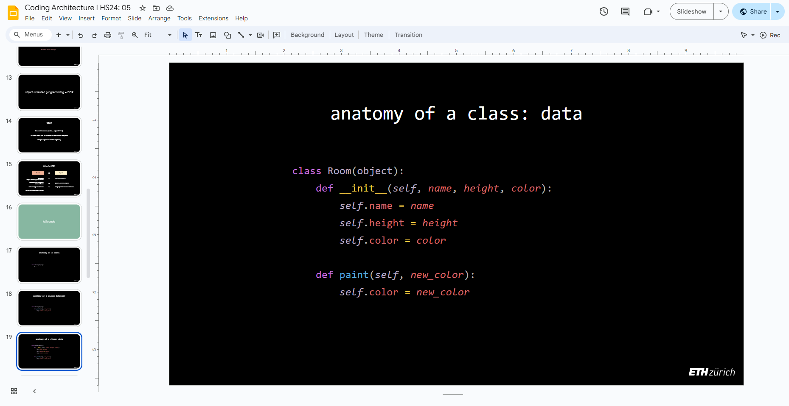

# Coding Architecture I: HS24

## Week 05 - Object Oriented Programming


## Table of Contents

* [Overview](#overview)
* [Slides](#slides)
* [What we've seen so far](#what-weve-seen-so-far)
* [Object Oriented Programming](#object-oriented-programming)
   * [Why OOP?](#why-oop)
   * [Procedural vs. Object Oriented Programming](#procedural-vs-object-oriented-programming)
   * [Anatomy of a Class](#anatomy-of-a-class)
   * [The Class constructor: `init` and the role of `self`](#the-class-constructor-init-and-the-role-of-self)
   * [Special Methods (Magic Methods)](#special-methods-magic-methods)
* [Assignment 02](#assignment-02)
* [Code Examples](#code-examples)
* [Micro Exercises](#micro-exercises)

## Overview

This week's lecture digs into a new concept: object-oriented programming. We will learn how to structure our code using **classes** and **objects**, and how to bundle data and behavior into reusable components (not Grasshopper components).

>**Learning Goals:** Understand the basic principles of **object-oriented programming** and apply them in **computational geometry**.


## Slides

[](https://docs.google.com/presentation/d/19t8eqQCtPHdg9MxIoSehAoC_g9l2zHzcWFpoEbAQoCc/edit?usp=sharing)

<div style="display: flex; justify-content: center; align-items: center; height: 1vh;">
    <p style="font-size: 75%;">
        ↑ click to open ↑
    </p>
</div>

## What we've seen so far

We have previously learned how to work with data and how to structure simple algorithms to manipulate that data. We've covered the following concepts:

**Defining Data**

- Single values (e.g., integers, floats, strings, booleans) represent individual pieces of information.
- Single values of geometric type (e.g., points, boxes, frames).
- Multiple values stored in collections, such as lists, sets and dictionaries.

**Defining Algorithms**

- Sequential operations execute instructions in a specific order, like processing a list of points one by one.
- Conditional operations (e.g., if statements) allow us to make decisions based on certain conditions.
- Loops enable us to repeat blocks of code, to perform the same action multiple times (without having to copy&paste it) in order to work with multiple objects, for example, lists of values.

**Re-using Algorithms**

- Functions let us encapsulate code into reusable blocks. This means we can write an algorithm once and apply it repeatedly across different scenarios, making our code more modular and easier to read.

**Re-using Algorithms + Data: ?** 

But what happens when we want to reuse both data and behavior? What happens when we need to define behavior that needs specific data to work with? For example, in an architectural context, we might want to create rooms, and for each room, we would like to calculate the volume, or the area for painting, or dig into what materials are used on the walls and calculate different values. Each of these functions are behaviors that belong conceptually to the class of objects of type `Room`, so it makes sense to write this code in the same location.

## Object Oriented Programming

Object-Oriented Programming (OOP) allows us to organize our code better, and bundle variables containing data and functions expressing behavior into something called `class`:

  * A `class` is a blueprint for creating objects.
  * An `object` is an instance of a class, it has its own set of data attached to it, as well as behavior.
  * Variables that are attached/belong to a class are called `attributes`
  * Functions that are attached/belong to a class are called `methods`.

 In this way, a class is a **container** that carries both the data and the algorithms that go with it, and provides a coherent and unified component that we can work with, reuse, create multiple copies of, and so on.

### Why OOP?

What’s the benefit?

  * Reusable code (data + algorithms as a **building block**)
  * Mirrors how we think about real-world objects
  * Helps organize code logically, because writing programs gets harder as the program gets bigger


### Procedural vs. Object Oriented Programming

This way of organizing your code becomes particularly valuable when working with large numbers of objects that need to be created and processed. Instead of managing a single room or a few bricks, you can manage thousands of them by reusing code. OOP makes it easier to modify, scale, and maintain your program well structured, as all objects of a given class share the same structure and behavior, ensuring consistency and reducing complexity.

```python
# ------------------------------------------------
# ------------ Procedural Programming ------------

length = 10
width = 5
area = length * width
print("Area of the room:", area)    

# This works, but there's no clear concept of "room",
# only of the arithmetic involved in this specific calculation.


# ------------------------------------------------
# ---------- Object Oriented Programming ---------

class Room(object):
    def __init__(self, length, width):
        self.length = length
        self.width = width

    def calculate_area(self):
        return self.length * self.width

# ------------------------------------------------
# -------- Working with Multiple Objects ---------

rooms = []
rooms.append(Room(10, 5))
rooms.append(Room(8, 6))
rooms.append(Room(12, 4))
rooms.append(Room(9, 7))
rooms.append(Room(11, 3))

for room in rooms:
    print("Area of room:", room.calculate_area())

```

### Anatomy of a Class

A class in Python can be seen as a template for creating objects. Objects, in turn, are instances of a class, representing specific examples based on that template. Classes define the attributes (data) and methods (behavior) that the objects will have. Think of it as a way to define the blueprint for architectural elements—whether you’re designing a room, a brick, or a structure—by specifying its dimensions and behaviors. Consider a class that defines a room. This class (or type) for rooms has specific attributes like height, color, etc, and a method that calculates the volume of a given room. When you create an object of this class (e.g., a kitchen), the object is an instance of that blueprint with specific dimensions.

In Python, a class defines both attributes (data) and methods (behaviour) that belong to its instances (objects). Instance attributes are unique to each object. This is analogous to defining a blueprint for a building, where instance attributes would represent unique characteristics of individual rooms or elements.


```python
# ------------------------------------------------
# ------------ Anatomy of a Class ----------------

class Room(object):
    # ...
```

```python
# ------------------------------------------------
# ------------ Behaviour (Methods) ---------------

class Room(object):
    def paint(self, new_color):
        self.color = new_color
```

```python
# ------------------------------------------------
# ------------- Data (Attributes) ----------------

class Room(object):
    def __init__(self, name, height, color):
        self.name = name
        self.height = height
        self.color = color

    # Methods
    def paint(self, new_color):
        self.color = new_color
```


#### Comparison to the COMPAS Box Class

The important thing to highlight is that we have been working with classes and objects from day 1! Remember: **Everything in Python is an object**!

For example, if you take a look at the source code for the [Box Class](https://github.com/compas-dev/compas/blob/aabed04/src/compas/geometry/shapes/box.py#L15) in the API Reference you will see that this object we have worked with already works (while more intricate) in a very similar way:

```python
class Box(Shape):
    [...]
    # the Class constructor here:
    def __init__(self, xsize=1.0, ysize=None, zsize=None, frame=None, name=None):
            super(Box, self).__init__(frame=frame, name=name)
            self._xsize = None
            self._ysize = None
            self._zsize = None
            self.xsize = xsize
            self.ysize = xsize if ysize is None else ysize
            self.zsize = xsize if zsize is None else zsize

    [...]

    # some of the methods connected to the Box Class

    def height(self):
        return self.zsize

    def area(self):
        return 2 * self.xsize * self.ysize + 2 * self.ysize * self.zsize + 2 * self.zsize * self.xsize
    
    def volume(self):
        return self.xsize * self.ysize * self.zsize
    
    [...]
```

### The Class constructor: `init` and the role of `self`

The `__init__` method (including the double underscores before and after!) is a special function in Python that initializes an object's attributes when an instance of a class is created. It is often referred to as the "constructor" of the class. This method is called automatically when you create an object from a class, and it's where you define the initial values for the object's attributes.

The `self` parameter represents the instance of the class that is being operated on. It’s how the object knows which instance’s attributes to reference or modify.

- When you create an object (say, `kitchen = Room("kitchen", 3, white)`), Python passes that object being created in that line as the first argument to the methods defined in the class.
- `self` allows each object to keep track of its own data (its specific height, name, etc.). Without `self`, you wouldn’t be able to differentiate between the attributes of one object and another.

```python
# -----------------------------------------------------
# ----------------- __init__ and self -----------------
class Room(object):
    # __init_ method to initialize the objects attributes
    def __init__(self, length, width, height):
        # 'self' refers to the current instance of the class
        self.length = length
        self.width = width
        self.height = height

    # Method to calculate the volume of the room
    # we pass self to tell Python that the `calculate_volume` method is related to the `Room` class
    def calculate_volume(self):
        return self.length * self.width * self.height

    # Method to calculate the area of the room
    def calculate_area(self):
        return self.length * self.width

# Create an object (instance) of the Room class
# we don't pass self here, Python automatically passes this

kitchen = Room(5, 3, 2.8)
# Create another object instance
livingroom = Room(8, 5, 2.8)

# Access attributes and call methods
print("Volume of the kitchen:", kitchen.calculate_volume())  # Output: 42.0 cubic meters
print("Area of the living room:", livingroom.calculate_area())      # Output: 40.0 square meters

# Create another Room object
living_room = Room(10, 5, 3.5)
print("Volume of the living room:", living_room.calculate_volume())  # Output: 175.0 cubic meters
```

### Special Methods (Magic Methods)

Special methods, also called magic methods, allow us to define how objects behave in some specific circumstances in Python. For example, we can define how an object creates a printable text-version of itself, so that if we call `print(variable_name)` on it, it can print some meaningful data. The following example gives the room the ability to print its dimensions when we call `print(room)`:

```python
class Room(object):
    def __init__(self, name, length, width):
        self.name = name
        self.length = length
        self.width = width

    def __str__(self):
        return "{}: {}m x {}m".format(self.name, self.length, self.width)

# Create a Room object
living_room = Room("Living Room", 5, 3)

# Output the room's dimensions using the __str__ method
# NOTE: we do not explicitly call the __str__ method!!
print(living_room)  # Output: Living Room: 5m x 3m

```


## Assignment 02


### Filtered Point Grid

The assignment of this week combines the filters we have seen in previous weeks with the concepts of object-oriented programming of this week as we move towards the creation of a building grid system.

Click the link [here](/assignments/A02-filtered-point-grid/README.md) to learn the details of assignment 2.

## Code Examples

The following files are useful to follow the lecture content:

- [Object-oriented programming: defining a Room class](./examples/01-room-class.gh)

## Micro Exercises

The following are very simple micro exercises that you can go through to practice some of the concepts of the current lecture. Each of them should not take more than 10 minutes to complete. They are completely optional.

1. Create a class called `House` with two attributes `name` and `address`. Create an instance of the class and print its name and address. Change the `address` in the instance and print again.

2. Create a function that calculates the volume of a cuboid given the parameters `width`, `height`, and `depth`. Call the function with different values to test it.

3. Create a class called `Brick` with attributes `width`, `height`, and `depth`. Add a method called `calculate_volume` (just like in the exercise above) that calculates and returns the volume of the brick. Create a few instances of the `Brick` class and call the `calculate_volume` method.

4. In a GHPython component with 3 inputs `width`, `height` and `depth`, repeat the definition of the class `Brick` from the previous exercise and add one method called `create_geometry` that returns a `Box` instance for the given inputs. Use the `Draw` component of COMPAS to visualize the output.

5.  Create a `Wall` class. Use a constructor (``__init__``) that requires `width`, `height`, and `thickness` of the wall as parameters. Add a method `calculate_volume` that returns the wall's volumne. Create an instance of `Wall` and print its volumne.

6. Create a `Building` class that has one attribute: a list of `Wall` instances as created in the previous exercise. Add a method called `calculate_volume_walls` that calculates the sum of all the volumes of all the building walls. Create an instance of `Building` with at least 4 wells and print the volumne of all its walls.

<details>
  <summary><b>Solutions</b></summary>

1. 
  
```python
class House(object):
    def __init__(self, name, address):
        self.name = name
        self.address = address

my_house = House("Home", "Josefstrasse 5")
print(my_house.name, my_house.address)
my_house.address = "Limmatstrasse 1"
print(my_house.name, my_house.address)
```

2. 

```python
def volume(width, height, depth):
    return width * height * depth

print(volume(1, 1, 1))
print(volume(2, 2, 2))
```

3.

```python
class Brick(object):
    def __init__(self, width, height, depth):
        self.width = width
        self.height = height
        self.depth = depth

    def calculate_volume(self):
        return self.width * self.height * self.depth

brick1 = Brick(2, 1, 10)
print(brick1.calculate_volume())

brick2 = Brick(2, 1, 5)
print(brick2.calculate_volume())
```

4. 
  
```python
from compas.geometry import Box

class Brick(object):
    def __init__(self, width, height, depth):
        self.width = width
        self.height = height
        self.depth = depth
    
    def calculate_volume(self):
        return self.width * self.height * self.depth

    def create_geometry(self):
        return Box.from_width_height_depth(self.width, self.height, self.depth)

my_brick = Brick(width, height, depth)
a = my_brick.create_geometry()
```

5. 
  
```python
class Wall(object):
    def __init__(self, width, height, thickness):
        self.width = width
        self.height = height
        self.thickness = thickness

    def calculate_volume(self):
        return self.width * self.height * self.thickness

my_wall = Wall(10, 10, 0.5)
print(my_wall.calculate_volume())
```

6. 

```python
# class Wall is same as previous micro exercise

class Building(object):
    def __init__(self, walls):
        self.walls = walls

    def calculate_volume_walls(self):
        volume = 0
        for wall in self.walls:
            volume += wall.calculate_volume()
        return volume


wall_1 = Wall(10, 10, 0.5)
wall_2 = Wall(10, 20, 0.7)
wall_3 = Wall(10, 10, 0.5)
wall_4 = Wall(10, 20, 0.7)

walls = [wall_1, wall_2, wall_3, wall_4]
my_building = Building(walls)
print(my_building.calculate_volume_walls())
```

</details>


---

<p align="middle">

</p>