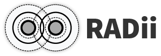

# Coding Architecture I: HS24

## Week 11 - Radii

## Table of Contents

* [Overview](#overview)
* [Slides](#slides)
* [Administration](#administration)
* [Radii](#radii)

## Overview

Today's lecture will provide some information regarding the final presentations, including deadlines and expectations. Additionally, we will introduce Radii, the augmented reality (AR) visualization tool that we will be using to visualize your projects during the presentations. Radii allows for real-time visualization and AR integration within Rhino and Grasshopper, enabling immersive and interactive exploration of your projects.

## Slides

    

        ↑ click to open ↑
    

## Administration

### Submission Final Project

>**Deadline:** Monday, 2nd of December at 12:00 (Midday)

### Presentation

>**Date:** Thursday, 5th of December at 15:45

>**Location:** HCI Room J7

For the final presentation, we will select approximately 10 projects that demonstrate interesting approaches. The selected authors will be asked to present their work in class.

### Exhibition

>**Date:** Roughly from 9.12 to 19.12

>**Location:** HIB Open Space

We will hold an exhibition featuring selected projects and potentially other interesting submissions.

### Grades

You will receive your grades for the final project in the week following the presentations.

## Radii

### What is Radii and Why Use It?

Radii is a tool for real-time visualization and augmented reality (AR) integration within Rhino and Grasshopper. It allows us to interact with our designs in an immersive and intuitive way. In this course, we will provide a basic introduction to Radii, but we won't explore its full potential. We may dive deeper into its capabilities in Coding Architecture II.

Radii allows us to push geometry, material, camera information, and more directly onto a server. This enables interactive viewing and manipulation of your projects in AR and VR. For the final presentation, Radii will be used to explore your projects in an immersive and interactive manner, allowing each of you to join the channel on your own machine and explore the submissions.

[CLICK HERE to view the radii overview!](/getting-started/radii/README.md)

---

